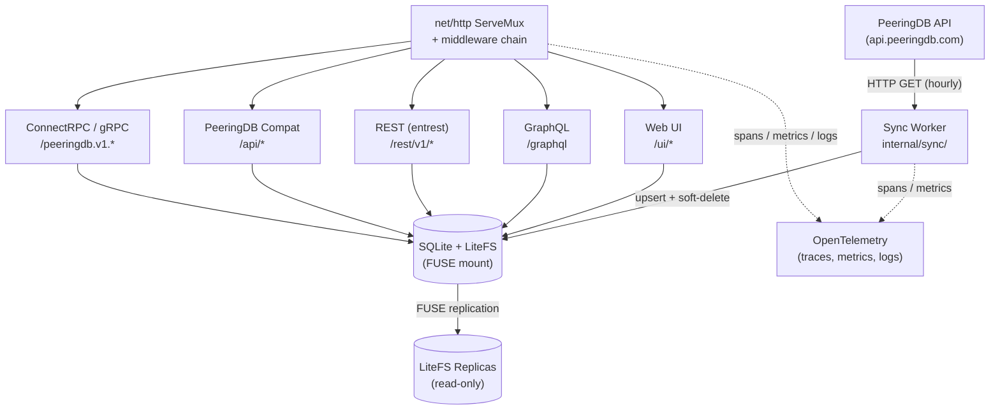
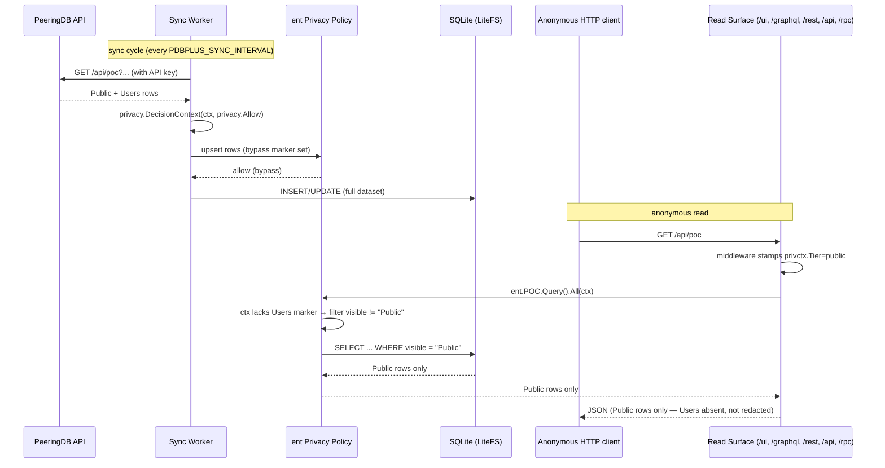

<!-- generated-by: gsd-doc-writer -->
# Architecture

## System overview

PeeringDB Plus is a globally distributed, read-only mirror of [PeeringDB](https://www.peeringdb.com)
data, implemented in Go. A single binary combines an in-process sync worker that periodically
re-fetches all PeeringDB objects with an HTTP server that exposes the mirrored data through five
coexisting API surfaces (Web UI, GraphQL, REST, a PeeringDB-compatible API, and ConnectRPC/gRPC).
Data is stored in SQLite, replicated to edge nodes by [LiteFS](https://fly.io/docs/litefs/), and
served with low latency from the nearest Fly.io region. Writes (schema migrations and data sync)
happen only on the LiteFS primary; all other instances are read-only replicas that can be promoted
at any time.

The architecture is heavily driven by [entgo](https://entgo.io/) code generation: a single set of
hand-edited schemas in `ent/schema/` drives generation of the database layer, the GraphQL server,
the REST server, and the ConnectRPC service definitions, keeping all API surfaces consistent with
the underlying data model.

## Component diagram



Only the node that currently holds the LiteFS lease (the primary) runs the sync worker's write
path. Replicas periodically re-check their role: on promotion, they begin syncing; on demotion,
they stop. Clients issuing write operations (the on-demand `POST /sync` trigger) are redirected
to the primary region via Fly.io's `fly-replay` header.

## Data flow

A typical read request flows as follows:

1. Fly.io terminates TLS at the edge and routes the request to the nearest healthy
   `peeringdb-plus` instance.
2. The Go HTTP server (`cmd/peeringdb-plus/main.go`) accepts the connection on `:8080` with HTTP/1.1
   and h2c (cleartext HTTP/2 for gRPC) enabled.
3. The middleware chain runs (`Recovery -> MaxBytesBody -> CORS -> OTel HTTP -> Logging ->
   PrivacyTier -> Readiness -> SecurityHeaders -> CSP -> Caching -> Gzip -> RouteTag`) before
   dispatching to the mux (`cmd/peeringdb-plus/main.go` — `buildMiddlewareChain`).
4. The request is dispatched to one of the five API surfaces based on URL path.
5. The handler reads from the local SQLite file via the ent client. Because SQLite is a local file
   (mounted through LiteFS FUSE), reads never leave the instance.
6. The response is serialized into the requested wire format (HTML, JSON, Protobuf, GraphQL,
   OpenAPI JSON) and passes back through the middleware chain for compression, caching headers, and
   OTel span completion.

The sync data flow (one cycle per `PDBPLUS_SYNC_INTERVAL`, default `1h` unauthenticated / `15m`
authenticated):

1. The scheduler in `internal/sync/worker.go` (`Worker.StartScheduler`) wakes up and
   checks `IsPrimary()`. Replicas loop without syncing.
2. Phase A — fetch: the worker calls `api.peeringdb.com` for every object type using
   `internal/peeringdb/client.go`, accumulating all responses in memory scratch space
   (`internal/sync/scratch.go`).
3. A memory guardrail (`PDBPLUS_SYNC_MEMORY_LIMIT`, default `400MB`) aborts the sync if
   `runtime.MemStats.HeapAlloc` exceeds the ceiling before the transaction opens.
4. Phase B — apply: the worker opens a single ent transaction, upserts all rows, soft-deletes
   rows no longer present in PeeringDB by stamping `status="deleted"` plus the per-cycle
   `cycleStart` timestamp on `updated` (`internal/sync/upsert.go`, `internal/sync/delete.go` —
   the 13 `markStaleDeleted*` functions), and commits.
   `PRAGMA defer_foreign_keys = ON` is set on the same connection (`internal/sync/worker.go`) to
   keep FK enforcement while allowing mid-transaction orphan handling.
5. The `OnSyncComplete` callback updates cached object-count metrics and the HTTP cache ETag, then
   the `sync_status` table row is persisted.
6. LiteFS replicates the SQLite WAL to all replica regions in the background; replicas pick up the
   new data on their next read without restarting.

## Key abstractions

- **`ent.Client`** (`ent/client.go`) — Generated ent client; the single entry point for all typed
  database access across every API surface.
- **`schema.*` schemas** (`ent/schema/organization.go`, `ent/schema/network.go`, and 12 others) —
  Hand-edited ent schema definitions annotated with entgql, entrest, and entproto directives. The
  source of truth that drives all code generation. Hand-edited methods (Hooks, Policy,
  Annotations, Mixin) live in sibling files (`{type}_{method}.go`, `{type}_fold.go`,
  `pdb_allowlists.go`) that `cmd/pdb-schema-generate` never touches.
- **`peeringdb.Client`** (`internal/peeringdb/client.go`) — Rate-limit-aware HTTP client for
  `api.peeringdb.com`; returns a typed `RateLimitError` on HTTP 429 so the retry loop honors
  `Retry-After`.
- **`sync.Worker`** (`internal/sync/worker.go`) — Two-phase sync orchestrator with scheduler, retry
  backoff, primary gating, and memory guardrail.
- **`litefs.IsPrimaryWithFallback`** (`internal/litefs/primary.go`) — Primary detection with
  inverted-lease-file semantics and env var fallback for local dev.
- **`grpcserver.ListEntities[E, P]`** (`internal/grpcserver/generic.go:27`) — Generic paginated
  list helper parameterized over ent entity and proto message types; used by all 13 ConnectRPC
  services to avoid per-type duplication. The companion `StreamEntities[E, P]`
  (`internal/grpcserver/generic.go:94`) handles compound-keyset cursor streaming.
- **`middleware.CachingState`** (`internal/middleware/caching.go`) — Atomically swappable ETag
  keyed on the last successful sync completion time; one SHA-256 per sync, zero per request.
- **`pdbotel.SetupOutput`** (`internal/otel/provider.go`) — Bundles the OTel shutdown function and
  `LoggerProvider` so the dual slog handler can bridge log records into the OTel pipeline.
- **`chainConfig` / `buildMiddlewareChain`** (`cmd/peeringdb-plus/main.go`) — Single
  construction point for the HTTP middleware stack; the wrap order is regression-locked by
  `TestMiddlewareChain_Order` in `middleware_chain_test.go`.
- **`privfield.Redact`** (`internal/privfield/`) — Single source of truth for field-level
  redaction. Every API serializer that exposes a gated field (e.g. `ixlan.ixf_ixp_member_list_url`)
  calls `Redact(ctx, visible, value) (out string, omit bool)`; unstamped contexts fail-closed to
  `TierPublic`.
- **`unifold.Fold`** (`internal/unifold/unifold.go`) — Diacritic-insensitive folding (NFKD + ligature
  map) used to populate the 16 `<field>_fold` shadow columns spread across 6 entity types. The
  pdbcompat filter layer routes `__contains` / `__startswith` predicates to these shadow columns
  for parity with upstream PeeringDB's `unidecode` behaviour.

## Directory structure rationale

The project follows the standard Go layout (`cmd/` for binaries, `internal/` for non-exported
packages) with additional top-level directories for generated code and proto sources.

```
cmd/
  peeringdb-plus/         # Main binary: HTTP server, sync worker wiring
  pdb-schema-extract/     # Parses PeeringDB Django source into schema/peeringdb.json
  pdb-schema-generate/    # Generates ent/schema/*.go from schema/peeringdb.json
  pdb-compat-allowlist/   # Generates internal/pdbcompat/allowlist_gen.go (Phase 70)
  pdb-fixture-port/       # Ports pdb_api_test.py rows into parity fixtures (Phase 72)
  pdbcompat-check/        # Validates PeeringDB-compatibility responses
ent/
  schema/                 # Hand-edited ent schemas + sibling files (*_fold.go,
                          # *_policy.go, fold_mixin.go, pdb_allowlists.go)
  entc.go                 # Code-generation driver (runs ent + extensions + go:linkname patches)
  generate.go             # go:generate directives (ent + buf)
  rest/                   # Generated entrest HTTP handlers
  ...                     # Generated ent query/mutation code (one pkg per entity)
gen/
  peeringdb/v1/           # Generated proto Go + ConnectRPC interfaces (from buf generate)
graph/                    # Generated gqlgen GraphQL server + hand-written resolvers
proto/
  peeringdb/v1/
    v1.proto              # Generated by entproto (messages)
    services.proto        # Hand-written RPC service definitions
    common.proto          # Hand-written shared types (e.g., SocialMedia)
schema/
  peeringdb.json          # Intermediate PeeringDB schema used by pdb-schema-generate
  generate.go             # go:generate directive for schema regeneration
internal/
  config/                 # Env-var config loading, validation, fail-fast (CFG-1)
  database/               # SQLite open + ent client setup (WAL, FKs, busy timeout)
  litefs/                 # Primary/replica detection
  peeringdb/              # PeeringDB API client (rate-limiting, Retry-After parsing)
  sync/                   # Sync worker, scheduler, two-phase apply, sync_status table
  otel/                   # TracerProvider, MeterProvider, LoggerProvider setup + metrics
  middleware/             # Recovery, CORS, logging, CSP, caching, gzip, privacy_tier, etc.
  graphql/                # gqlgen handler wiring (complexity/depth limits, playground)
  grpcserver/             # ConnectRPC handlers (13 entities + generic + pagination)
  pdbcompat/              # Drop-in PeeringDB-compatible /api/ surface (incl. parity tests)
  privctx/                # Privacy tier in request context (TierFrom reader)
  privfield/              # Field-level redaction single source of truth (Redact)
  unifold/                # Diacritic-insensitive folding for shadow columns
  visbaseline/            # Visibility baseline + schema-alignment regression test
  web/                    # templ + htmx Web UI (handlers, templates, termrender)
  health/                 # /healthz and /readyz probes
  httperr/                # RFC 9457 Problem Details responses
  conformance/            # API-surface conformance tests
  testutil/               # Test helpers + deterministic seed data + parity fixtures
testdata/
  fixtures/               # 13 JSON files matching PeeringDB API response shapes
deploy/                   # Deployment-adjacent assets (Grafana dashboards, alerts)
```

## Code generation pipeline

`go generate ./...` runs the full pipeline in dependency order:

1. **`ent/generate.go`** first invokes `go run entc.go` (`ent/entc.go`), which:
   - Patches `go-openapi/inflect` and ent's internal inflect rules via `go:linkname` to fix
     `"campus"` -> `"campu"` mangling.
   - Configures three ent extensions:
     - `entgql` — emits `graph/schema.graphqls` and `graph/gqlgen.yml` with Relay spec + where
       inputs.
     - `entrest` — emits an OpenAPI-compliant HTTP handler at `ent/rest/`, read-only operations
       (`OperationRead`, `OperationList`) by default.
     - `entproto` — emits proto message definitions into `proto/peeringdb/v1/v1.proto`.
   - Enables the `sql/upsert`, `sql/execquery`, and `privacy` ent features (required by the sync
     worker's bulk upsert, per-connection `PRAGMA` execution, and the POC privacy policy
     respectively).

2. `ent/generate.go` then runs `cmd/pdb-compat-allowlist` to regenerate
   `internal/pdbcompat/allowlist_gen.go` from `schema.PrepareQueryAllows` declared in
   `ent/schema/pdb_allowlists.go` (Phase 70 cross-entity traversal allowlist).

3. `ent/generate.go` then runs `go tool buf generate` at the repo root, which reads `buf.gen.yaml`
   and invokes `protoc-gen-go` + `protoc-gen-connect-go` to emit Go types and ConnectRPC service
   interfaces under `gen/peeringdb/v1/`.

4. **`internal/web/templates/generate.go`** runs `go tool templ generate` to produce the
   type-safe `*_templ.go` files from `.templ` sources.

5. **`schema/generate.go`** runs `pdb-schema-generate` against `schema/peeringdb.json` to
   regenerate `ent/schema/*.go`. This step is re-runnable; hand-edited methods live in sibling
   files (e.g. `poc_policy.go`, `network_fold.go`) that the generator never touches — see
   [CLAUDE.md](../CLAUDE.md) for the conventions around this.

`buf`, `templ`, and `gqlgen` are declared as Go tool dependencies (`go tool buf`, `go tool templ`,
`go tool gqlgen`) and do not require external installation.

## Middleware chain

The HTTP middleware stack is assembled by `buildMiddlewareChain`
(`cmd/peeringdb-plus/main.go`). Outermost first:

1. **Recovery** (`internal/middleware/recovery.go`) — Catches panics, logs them, and returns a 500.
2. **MaxBytesBody** (`internal/middleware/maxbody.go`) — Caps non-gRPC request bodies at 1 MB
   (`maxRequestBodySize`). ConnectRPC and gRPC paths are skipped via a hardcoded prefix list to
   preserve streaming.
3. **CORS** (`internal/middleware/cors.go`) — Configurable via `PDBPLUS_CORS_ORIGINS`
   (default `*`).
4. **OTel HTTP** — `otelhttp.NewMiddleware("peeringdb-plus")` adds a server span per request and
   exports the standard `http.server.*` metrics.
5. **Logging** (`internal/middleware/logging.go`) — Structured slog access log with request ID
   correlation.
6. **PrivacyTier** (`internal/middleware/privacy_tier.go`, Phase 59 D-05) — Stamps the resolved
   `PDBPLUS_PUBLIC_TIER` value onto every inbound request context via `privctx.WithTier`. Sits
   between Logging and Readiness so even the Readiness 503 path carries the tier; downstream ent
   privacy policies and `privfield.Redact` callers consume it via `privctx.TierFrom(ctx)`.
7. **Readiness** — Returns 503 for all routes except `/sync`, `/healthz`, `/readyz`, `/`,
   `/favicon.ico`, `/static/*`, and `/grpc.health.v1.Health/*` until the first sync completes.
   Browser clients get a styled HTML syncing page; terminal clients get plain text; everything
   else gets JSON.
8. **SecurityHeaders** (`internal/middleware/security.go`) — HSTS (180-day default),
   `X-Content-Type-Options: nosniff`, and `X-Frame-Options: DENY` scoped to browser paths.
9. **CSP** (`internal/middleware/csp.go`) — Different policies for `/ui/` and `/graphql`. Served
   as `Report-Only` by default; switched to enforcing via `PDBPLUS_CSP_ENFORCE=true`.
10. **Caching** (`internal/middleware/caching.go`) — ETag-based conditional GETs keyed on the
    last sync completion time. `/ui/about` is opted out because it renders relative timestamps
    that would freeze under a sync-time key.
11. **Gzip / Compression** (`internal/middleware/compression.go`) — Response compression.
12. **RouteTag** (`cmd/peeringdb-plus/main.go` `routeTagMiddleware`) — Innermost wrap; injects
    `http.route` into the otelhttp labeler AFTER mux dispatch so `r.Pattern` is populated. Empty
    `r.Pattern` (404 traffic) is skipped to avoid `http.route=""` cardinality bloat.
13. **mux** — The `net/http` ServeMux dispatches to the specific handler.

Response-writer wrappers in every middleware must implement `http.Flusher` (for gRPC streaming)
and provide `Unwrap() http.ResponseWriter` for middleware-aware interface detection. The wrap
order is regression-locked by `TestMiddlewareChain_Order` in
`cmd/peeringdb-plus/middleware_chain_test.go`.

## API surfaces

All five surfaces are mounted on the same mux in `cmd/peeringdb-plus/main.go` and read from the
same ent client:

- **Web UI — `/ui/*`** (`internal/web/`) — templ-rendered HTML + htmx (no JS build toolchain).
  Served by `(*Handler).dispatch` in `internal/web/handler.go`. `/static/*` serves bundled
  assets. `GET /` content-negotiates between terminal, browser, and JSON clients via
  `internal/web/termrender/`.

- **GraphQL — `/graphql`** (`internal/graphql/`, `graph/`) — `GET` serves the GraphiQL playground;
  `POST` runs queries through the gqlgen handler produced by entgql. Resolvers are in
  `graph/*.resolvers.go`; complexity and depth limits are applied in `pdbgql.NewHandler`. The
  hand-written `IxLan.ixfIxpMemberListURL` resolver routes through `privfield.Redact` so the
  field returns `null` for callers below the required tier.

- **REST — `/rest/v1/*`** (`ent/rest/`) — OpenAPI-compliant handler generated by entrest.
  Read-only by default (`OperationRead` + `OperationList`). Error responses are rewritten into
  RFC 9457 Problem Details by `restErrorMiddleware` (`cmd/peeringdb-plus/main.go`); a sibling
  `restFieldRedactMiddleware` (wrapped INSIDE `restErrorMiddleware`) buffers `/rest/v1/ix-lans*`
  responses and deletes the JSON key in-place when `privfield.Redact` returns `omit=true`.

- **PeeringDB-compatible — `/api/*`** (`internal/pdbcompat/`) — Drop-in replacement for the
  PeeringDB API shape, including `depth` expansion, filter parameters, the canonical response
  envelope, and the response memory envelope (Phase 71 — see § Response Memory Envelope below).
  Uses a type registry (`internal/pdbcompat/registry.go`) to dispatch by object type. The pk-lookup
  path (`internal/pdbcompat/depth.go`) inlines `StatusIn("ok", "pending")` at every call site so
  Phase 68 tombstones return 404 on direct-ID GETs.

- **ConnectRPC / gRPC — `/peeringdb.v1.*`** (`internal/grpcserver/`, `gen/peeringdb/v1/`) — All 13
  entity types expose `Get`, `List`, and `Stream` RPCs. Handlers are registered in a loop in
  `cmd/peeringdb-plus/main.go` wrapped with `otelconnect.NewInterceptor`. Server reflection
  (`grpcreflect.NewHandlerV1`/`V1Alpha`) and a health check (`grpchealth.NewStaticChecker`) are
  served on the same mux, so both `grpcurl` and gRPC health clients work against the running
  server. The health check is held in `NOT_SERVING` until the first sync completes, then flips to
  `SERVING` for the root service and every registered service name.

## Ordering

All list endpoints return rows in compound `(-updated, -created, -id)` order by default, matching
upstream PeeringDB's `django-handleref` base `Meta.ordering = ("-updated", "-created")` plus a
deterministic `id DESC` tertiary tiebreaker for cross-replica consistency. The ordering contract
spans three surfaces — pdbcompat `/api/<type>`, entrest `/rest/v1/<type>`, and ConnectRPC
`List*`/`Stream*` RPCs — with parity verified end-to-end by
`cmd/peeringdb-plus/ordering_cross_surface_e2e_test.go`.

- **pdbcompat** and **ConnectRPC** emit the full compound `ORDER BY` directly via ent
  (`internal/pdbcompat/registry_funcs.go` and the `List<Entity>`/`Stream<Entity>` closures in
  `internal/grpcserver/*.go`).
- **entrest** uses an in-tree template override at `ent/templates/entrest-sorting/sorting.tmpl`
  because entrest's annotation API is single-field; the template injects `created, id` tie-breakers
  (in the requested sort direction) whenever the request's sort field matches each schema's
  declared default (`updated`). Explicit `?sort=<field>&order=<dir>` overrides are honoured
  unchanged.
- **Nested `_set` arrays at depth ≥ 1** (entrest only): entrest's eager-load template calls
  `applySorting<Type>` on auto-eagerloaded relations, so `/rest/v1/<type>` responses also carry
  nested `edges.<relation>` arrays in compound order — matching upstream PeeringDB's Django
  serializer behaviour for nested relations. Covered by `TestEntrestNestedSetOrder`.
- **ConnectRPC streaming** uses a compound `(last_updated, last_id)` keyset cursor
  (base64-encoded as `RFC3339Nano:id`) for stable pagination under concurrent mutation. The
  `page_token` proto field is opaque `string`; no proto regeneration or client-facing change was
  required. Covered by `TestCursorResume_CompoundKeyset` in `internal/grpcserver/`.
- **GraphQL** uses the Relay Connection spec with its own opaque cursors and is unaffected by this
  contract. **Web UI** ordering is handler-local and not part of the list-endpoint guarantee.
- **Performance:** every one of the 13 entity tables carries an `updated` index declared via
  `index.Fields("updated")` in `ent/schema/<entity>.go`, so `ORDER BY updated DESC, id DESC` hits
  an index scan rather than a full-table sort. Post-deploy verification:
  `sqlite3 /litefs/peeringdb-plus.db '.schema'` should list a `<entity>_updated` index for every
  entity.

## Privacy layer

PeeringDB tags per-row visibility (`visible="Public" | "Users" | "Private"`
on POCs; see [CONFIGURATION.md §Privacy & Tiers](./CONFIGURATION.md#privacy--tiers)
for the end-to-end model). PeeringDB Plus honours this upstream visibility
through two complementary mechanisms — a row-level ent Privacy policy and a
field-level redaction helper — wired in `ent/entc.go`. The inversion is the
non-obvious part: **the sync worker writes the full dataset (bypass); every
read path applies the filter (policy / redaction).**

The pieces:

1. **Request context stamping** (`internal/privctx/` — `privctx.Tier`,
   `privctx.WithTier`, `privctx.TierFrom`). A dedicated HTTP middleware
   (`internal/middleware/privacy_tier.go`) inspects the incoming request,
   reads `PDBPLUS_PUBLIC_TIER` from config, and stamps a `privctx.Tier`
   value on the request context. The middleware sits between Logging and
   Readiness in the chain, so every one of the five API surfaces inherits
   the tier via `r.Context()`.
2. **Row-level — ent Privacy policy** (`entgo.io/ent/privacy`, feature
   `privacy` enabled in `ent/entc.go`). The POC entity (`ent/schema/poc.go`,
   with `Policy()` in sibling file `ent/schema/poc_policy.go`) has a
   `Policy()` method whose query rule rejects rows with
   `visible != "Public"` unless the context carries a Users-tier marker.
   The policy is evaluated on every ent query; the five read surfaces
   (`/ui/`, `/graphql`, `/rest/v1/`, `/api/`, `/peeringdb.v1.*`) all flow
   through the same `ent.Client`, so there is exactly one filter, not five.
   POC is the only entity where a whole row can be hidden.
3. **Field-level — `privfield.Redact`** (`internal/privfield/`, Phase 64).
   `Redact(ctx, visible, value) (out string, omit bool)` is the single
   source of truth for per-field redaction. Every API serializer that
   exposes a gated field calls `Redact`; unstamped contexts fail-closed to
   `TierPublic`. The current gated field is
   `ixlan.ixf_ixp_member_list_url` (gated by sibling
   `ixf_ixp_member_list_url_visible`). Each of the five surfaces hosts the
   call at a different layer:
   - **pdbcompat** — `internal/pdbcompat/serializer.go` (json `,omitempty`
     handles wire absence).
   - **ConnectRPC** — `internal/grpcserver/ixlan.go` (nil
     `*wrapperspb.StringValue` → wire omission).
   - **GraphQL** — `graph/schema.resolvers.go` `IxLan.ixfIxpMemberListURL`
     custom resolver returns `nil` when `omit=true`.
   - **entrest** — `restFieldRedactMiddleware` buffers
     `/rest/v1/ix-lans*` responses and deletes the JSON key in-place when
     `omit=true`. Wraps INSIDE `restErrorMiddleware` so problem+json error
     bodies pass through untouched.
   - **Web UI** — no current render path; future templates call
     `privfield.Redact` in the data preparation step.

   The `_visible` companion field is itself emitted to anonymous callers
   (matches upstream PeeringDB behaviour); only the gated value field is
   redacted.
4. **Sync-worker bypass** (`internal/sync/worker.go`,
   `internal/sync/upsert.go`). The sync worker wraps its ent client calls
   in `privacy.DecisionContext(syncCtx, privacy.Allow)`. This marker
   short-circuits the policy so writes land the full dataset —
   `Users`-tier rows go into the DB — regardless of the caller tier that
   would otherwise apply. A single-call-site audit test (Phase 59) keeps
   the bypass scoped to the worker.
5. **Observability** (Phase 61). Startup logs a `sync mode` line
   (`auth=authenticated|anonymous`). A WARN line
   (`public tier override active`) fires whenever `PDBPLUS_PUBLIC_TIER=users`.
   Read-path spans carry an OTel attribute `pdbplus.privacy.tier` with
   value `public` or `users`, usable as a Grafana dashboard filter.

### Sync write vs anonymous read — sequence diagram



All five read surfaces share this flow. Custom per-surface logic is not
needed for row-level filtering: the middleware stamps the tier once, and
ent's policy enforcement fires on every generated query. Field-level
redaction is per-surface (each serializer calls `privfield.Redact` at its
own layer), but the routing decision is centralised.

Operator control surface:

- `PDBPLUS_PEERINGDB_API_KEY` — set to enable authenticated sync; absence
  is still supported (no `Users`-tier rows reach the DB, the filter is a
  no-op).
- `PDBPLUS_PUBLIC_TIER=users` — elevate anonymous callers to Users-tier for
  private-instance deployments. Logged with WARN at startup;
  `pdbplus.privacy.tier=users` on read spans.

See [CONFIGURATION.md](./CONFIGURATION.md#privacy--tiers) and
[DEPLOYMENT.md](./DEPLOYMENT.md#authenticated-peeringdb-sync-recommended)
for the operator-facing rollout.

## Soft-delete tombstones

Sync uses soft-delete (Phase 68) rather than hard-delete across all 13 entity types. The 13
`markStaleDeleted*` functions in `internal/sync/delete.go` set
`status='deleted', updated=cycleStart` on rows absent from the upstream response, where
`cycleStart` is the `start := time.Now()` timestamp captured at the top of `Worker.Sync` and
plumbed through `syncStep.deleteFn`. A single timestamp is stamped on every tombstone produced
within a single sync cycle so `?since=N` windows stay atomic.

The pdbcompat list path (`internal/pdbcompat/registry_funcs.go`) appends
`applyStatusMatrix(isCampus, opts.Since != nil)` to the predicate chain for every entity to
mirror upstream PeeringDB's `rest.py` status × since matrix; the pk-lookup path
(`internal/pdbcompat/depth.go`) inlines `StatusIn("ok", "pending")` at every call site so
direct-ID GETs return 404 for tombstones.

Tombstone GC is dormant (see `.planning/seeds/SEED-004-tombstone-gc.md`); triggers are storage
growth >5% MoM, tombstone ratio >10%, or operator request.

## Shadow-column folding

`internal/unifold` is the single source of truth for diacritic-insensitive folding (Phase 69).
Sixteen `<field>_fold` shadow columns are spread across 6 entity types
(`organization`, `network`, `facility`, `internetexchange`, `carrier`, `campus`), declared via
the `foldMixin` in sibling files (`{type}_fold.go`). Each `_fold` column carries
`entgql.Skip(SkipAll)` and `entrest.WithSkip(true)` annotations so the shadow never leaks onto
GraphQL, REST, or proto wire surfaces — they are server-side plumbing only.

The sync upsert path (`internal/sync/upsert.go`) chains
`.Set<Field>Fold(unifold.Fold(x.<Field>))` setters as a trailing block on each affected entity's
create builder; `OnConflict().UpdateNewValues()` rewrites `_fold` columns on every re-sync.

The pdbcompat filter layer (`internal/pdbcompat/filter.go`) reads `tc.FoldedFields[field]` and
threads `folded bool` into `buildPredicate`. When `folded == true`, `buildContains` and
`buildStartsWith` route to `<field>_fold` with `unifold.Fold(value)` on the RHS via
`sql.FieldContainsFold` / `FieldHasPrefixFold`, matching upstream PeeringDB's `unidecode`
filter semantics.

## Cross-entity traversal

Filter keys with `__` separators (e.g. `?org__name__contains=acme`) traverse from the requested
entity to a related entity (Phase 70). Two paths resolve the target field:

- **Path A (allowlist)** — `internal/pdbcompat/allowlist_gen.go`, regenerated by
  `cmd/pdb-compat-allowlist` from `schema.PrepareQueryAllows` declared in
  `ent/schema/pdb_allowlists.go`. Every entry carries a `// Source: serializers.py:<line>`
  comment for upstream-parity audit.
- **Path B (ent-edge introspection)** — `internal/pdbcompat/introspect.go` walks codegen-time
  static maps (`LookupEdge` / `ResolveEdges` / `TargetFields`) instead of runtime
  `client.Schema.Tables` — the `cmd/pdb-compat-allowlist` step emits the maps from the same
  schema source as Path A, avoiding init-order coupling.

Traversal predicates compose with the soft-delete status matrix and shadow-column folding:
the status matrix predicate is appended LAST to every `registry_funcs.go` closure, and a
traversal target field that happens to be folded uses `<field>_fold` with `unifold.Fold(value)`
on the RHS. A 2-hop cap (`parseFieldOp`) drops 3+-hop keys at request time.

## LiteFS primary/replica detection

LiteFS uses an *inverted* lease file: the presence of `/litefs/.primary` indicates a *replica*
(the file contains the primary's hostname), and its *absence* indicates the *primary*
(`internal/litefs/primary.go` — `PrimaryFile` constant).

`IsPrimaryWithFallback(path, envKey)` (`internal/litefs/primary.go`) checks three conditions in
order:

1. If `/litefs/.primary` exists, this node is a replica (`false`).
2. If `/litefs/` (the parent directory) exists, LiteFS is mounted and no primary file means this
   node holds the lease (`true`).
3. Otherwise (no LiteFS at all — typical in local dev), parse the `PDBPLUS_IS_PRIMARY` env var
   (default `true`).

Primary status is checked *live* on every scheduler tick (`cmd/peeringdb-plus/main.go` —
`isPrimaryFn`), so LiteFS-driven promotions and demotions take effect without a process restart.
The sync worker's scheduler also handles role transitions: promoted replicas begin running sync
cycles; demoted primaries stop.

The on-demand sync endpoint (`POST /sync`) uses `IsPrimaryFn` to decide whether to run the sync
locally, return a Fly.io `fly-replay` header pointing at `PRIMARY_REGION`, or 503 in local dev
(`cmd/peeringdb-plus/main.go` — `newSyncHandler`). Fly.io handles the replay; the app itself
does not forward HTTP traffic.

The app listens directly on `:8080` with h2c enabled and does **not** sit behind the LiteFS proxy,
because the proxy does not handle HTTP/2 streaming RPCs. LiteFS runs as a separate FUSE process
whose mount point is inspected by the detection code above.

### Fleet topology (v1.15+)

The app runs under two Fly process groups — `primary` (1 machine,
LHR, `shared-cpu-2x`/512 MB, persistent `litefs_data` volume) and
`replica` (7 machines, other regions, `shared-cpu-1x`/256 MB,
ephemeral rootfs). The process-group split reinforces but does not
replace the region-gated LiteFS candidacy: `litefs.yml`'s
`lease.candidate: ${FLY_REGION == PRIMARY_REGION}` <!-- VERIFY: litefs.yml `lease.candidate` expression --> remains the sole
source of truth for "which machine may become primary". The process
groups exist to scope `[[vm]]` sizing and `[[mounts]]` to the
primary-only tier (per `fly.toml`'s `[[mounts]] processes = ["primary"]`
constraint). Replicas cold-sync the SQLite DB from primary over LiteFS
HTTP on boot; `/readyz` fail-closes during hydration so Fly Proxy
excludes them until ready. Replica recovery = destroy-and-recreate (no
volume management). See `docs/DEPLOYMENT.md` § Asymmetric fleet for the
operator runbook.

## OpenTelemetry instrumentation

OTel is set up once at startup in `internal/otel/provider.go` (`Setup`). Three signal providers
are configured via the OpenTelemetry autoexport package, which reads standard `OTEL_*` env vars
to select exporters (OTLP, stdout, none):

- **`TracerProvider`** — Sampler is `sdktrace.ParentBased(NewPerRouteSampler(...))` per Phase 77
  OBS-07. Per-route ratios live in `internal/otel/sampler.go` (`perRouteSampler`); see the
  Sampling Matrix below. The default ratio honours `PDBPLUS_OTEL_SAMPLE_RATE` (default `1.0`)
  for sync-worker spans and any other non-HTTP traces. Spans are created automatically by
  `otelhttp` middleware for HTTP requests, by `otelconnect.NewInterceptor` for ConnectRPC RPCs,
  and by the sync worker for sync cycles. Ent schema hooks (`ent/runtime` imported for side
  effects in `cmd/peeringdb-plus/main.go`) emit mutation spans for every ent write.

### Sampling Matrix

Per-route sampling is configured in `internal/otel/sampler.go` (`perRouteSampler`) and wrapped
in `sdktrace.ParentBased` so child spans inherit the root decision (cross-service trace
continuity invariant from Phase 77 CONTEXT.md D-02):

| Route prefix | Ratio | Rationale |
|--------------|-------|-----------|
| `/healthz`, `/readyz`, `/grpc.health.v1.Health/` | 0.01 | Fly health probes — 1% sample is enough for liveness debugging without dominating Tempo volume. Pre-Phase-77 measurement: `/healthz` was ~99% of HTTP trace volume. |
| `/api/`, `/rest/v1/`, `/peeringdb.v1.` | 1.0 | Primary API surfaces — full sampling for debugging. |
| `/graphql` | 1.0 | Mid-volume; full sampling pending v1.19+ cardinality reassessment. |
| `/ui/` | 0.5 | Browser traffic; halved per the Phase 77 audit. |
| `/static/`, `/favicon.ico` | 0.01 | Static assets; rare debugging value. |
| (default — sync worker, internal spans) | `PDBPLUS_OTEL_SAMPLE_RATE` (default 1.0) | Sync cycles + non-HTTP traces honour the existing env var. |

`ParentBased` composition guarantees that once a parent span samples in (e.g. an `/api/net`
request), all child spans (including any internal call to a lower-ratio endpoint or downstream
RPC fan-out) inherit the sampled decision regardless of their own route prefix. This prevents
orphaned spans where a sampled-in parent calls a sampled-out endpoint.

Longest-prefix-wins applies inside the sampler: future paths like `/api/auth/foo` would inherit
the `/api/` ratio (1.0) by default, but adding a more-specific `/api/auth/` entry with a lower
ratio would let that subpath drop independently. Boundary rule: prefixes that end in an
alphanumeric character (e.g. `/api`) require `/` after them; prefixes that end in a non-
alphanumeric character (e.g. `/peeringdb.v1.` or `/static/`) accept any next character —
needed for ConnectRPC's dot-terminated package prefixes.

`OTEL_BSP_SCHEDULE_DELAY=5s` and `OTEL_BSP_MAX_EXPORT_BATCH_SIZE=512` (PERF-08 baseline) are
hardcoded in `internal/otel/provider.go` and confirmed appropriate for current cardinality per
the Phase 77 audit (`.planning/phases/77-telemetry-audit/AUDIT.md`).

- **`MeterProvider`** — Exposes standard `http.server.*` metrics (from otelhttp) and custom sync
  metrics registered in `internal/otel/metrics.go` (`InitMetrics`):
  - `pdbplus.sync.duration` (histogram) — buckets 1/5/10/30/60/120/300 seconds.
  - `pdbplus.sync.operations` (counter) — labelled by status (success/failed).
  - `pdbplus.sync.type.objects` (counter) — per-type object counts.
  - `pdbplus.sync.type.deleted` (counter) — per-type tombstone counts.
  - `pdbplus.sync.type.fetch_errors` / `upsert_errors` / `fallback` / `orphans` (counters).
  - `pdbplus.role.transitions` (counter) — LiteFS promote/demote events.
  - Object-count gauges per type (`InitObjectCountGauges`) backed by an atomic cache updated on
    every successful sync, avoiding live `COUNT(*)` queries.
  - A freshness gauge (`InitFreshnessGauge`) derived from the `sync_status` table.
  - Sync-cycle peak heap/RSS gauges (`InitMemoryGauges` —
    `pdbplus.sync.peak_heap_bytes`, `pdbplus.sync.peak_rss_bytes`).
  - Per-request response heap-delta histogram (`InitResponseHeapHistogram` —
    `pdbplus.response.heap_delta`, exported to Prometheus as
    `pdbplus_response_heap_delta_bytes`).

  Two explicit views reshape instruments for cost control: `http.server.request.body.size` is
  dropped (low debugging value, high cardinality), and `rpc.server.duration` buckets are capped at
  a 5-boundary set.

  **Resource attributes (post-260426-lod).** `internal/otel/provider.go` `buildResourceFiltered`
  emits the OTel resource via two filtered constructors — `buildResource` (full) for traces /
  logs, `buildMetricResource` (omits `service.instance.id`) for metrics. Grafana Cloud's hosted
  OTLP receiver only promotes a small allowlist of OTel semconv resource attrs to Prometheus
  labels (`service.*`, `cloud.*`, `host.*`, `k8s.*`); custom keys outside that allowlist are
  silently dropped on the metrics path:

  | Env var | Resource attr | semconv key | Metrics? | Traces / logs? |
  |---|---|---|---|---|
  | `FLY_REGION` | `cloud.region` | `semconv.CloudRegion` | yes | yes |
  | `FLY_PROCESS_GROUP` | `service.namespace` | `semconv.ServiceNamespace` | yes | yes |
  | `FLY_MACHINE_ID` | `service.instance.id` | `semconv.ServiceInstanceID` | NO (per-VM cardinality) | yes |
  | `FLY_APP_NAME` | `fly.app_name` | (custom) | dropped by GC <!-- VERIFY: Grafana Cloud allowlist behaviour --> | yes (human grep) |
  | (constant) | `cloud.provider="fly_io"` | `semconv.CloudProviderKey` | yes | yes |
  | (constant) | `cloud.platform="fly_io_apps"` | `semconv.CloudPlatformKey` | yes | yes |

  The `service.instance.id` strip on the metric resource is gated by `includeInstanceID` in
  `buildResourceFiltered`. `service.namespace` (2-cardinality: primary / replica) and
  `cloud.region` (8-cardinality) stay on metrics because they answer the operator's actual
  breakdown questions; the dashboard's `process_group` template variable depends on
  `service.namespace`.

- **`LoggerProvider`** — The stdlib `log/slog` logger is wrapped in a *dual handler*
  (`pdbotel.NewDualLogger` in `internal/otel/logger.go`) that writes to stdout *and* bridges
  records into the OTel log pipeline simultaneously. Setting it as the default with
  `slog.SetDefault` means every `slog.Info/Warn/Error` call throughout the codebase emits both a
  human-readable stdout line and an OTel log record without per-call adaptation. The OTel branch
  is filtered by `PDBPLUS_LOG_LEVEL` (default `INFO`); the stdout handler stays at INFO
  independently.

Standard runtime metrics are collected via `go.opentelemetry.io/contrib/instrumentation/runtime`
(wired through `internal/otel/provider.go`) and emit per-instance `go_memory_used_bytes`,
`go_goroutine_count`, `go_gc_duration_seconds` gauges on every machine (live tick), coexisting
with the `pdbplus_sync_peak_*` sync-cycle watermarks (primary only). All providers are shut down
on SIGINT/SIGTERM via the `SetupOutput.Shutdown` closure, which runs inside the drain window
(`PDBPLUS_DRAIN_TIMEOUT`, default `10s`).

## Response Memory Envelope

v1.16 Phase 71 — pdbcompat list responses are gated by a per-request
memory budget so the 256 MB Fly replicas never OOM under `limit=0`,
depth=2, or 2-hop traversal responses enabled by Phases 68 + 70. The
ceiling is enforced by a pre-flight `SELECT COUNT(*) × typical_row_bytes`
heuristic that returns RFC 9457 `application/problem+json` 413 BEFORE
any row data is fetched, and bytes are streamed through the response
writer once the budget check passes.

### The envelope

```
256 MB replica total
  − 80 MB Go runtime baseline (observed v1.15 Phase 66 telemetry)
  − 48 MB slack (other in-flight requests + GC overhead)
  = 128 MiB PDBPLUS_RESPONSE_MEMORY_LIMIT default
```

Operators tune via the `PDBPLUS_RESPONSE_MEMORY_LIMIT` env var
(`docs/CONFIGURATION.md`). A unit suffix is mandatory (`KB`/`MB`/`GB`/`TB`);
the literal value `0` disables the check (local development only — do
NOT disable in prod). The default sits under the 256 MB replica cap
with margin so the order under pressure is: 413 → dashboard alert →
operator action, never OOM-kill.

### The three moving parts

| File | Responsibility |
|---|---|
| `internal/pdbcompat/stream.go` | Hand-rolled JSON token writer. `StreamListResponse(ctx, w, meta, rowsIter)` emits `{"meta":…,"data":[…]}` with per-row `json.Marshal` and periodic `http.Flusher.Flush()` (every 100 rows). No full-result `[]any` materialisation on the wire. |
| `internal/pdbcompat/rowsize.go` | Hardcoded `map[string]RowSize{Depth0, Depth2}` calibrated from `bench_row_size_test.go` then doubled per D-03. Conservative by design — false-positive 413s are preferred over OOM. Recalibrated every major milestone; drift >20% triggers a refresh plan. |
| `internal/pdbcompat/budget.go` | `CheckBudget(count, entity, depth, budgetBytes) (BudgetExceeded, bool)` multiplies `count × TypicalRowBytes(entity, depth)`. Over-budget requests get 413 via `WriteBudgetProblem` BEFORE the row data is fetched; the RFC 9457 body carries `max_rows = budget / per_row` and `budget_bytes` so clients can re-slice their request. |

### Per-entity worst-case sizing

Values are the DOUBLED figure from `BenchmarkRowSize_*` (Plan 02
calibration, 2026-04-19, with the WR-02 bump for `org` Depth0), rounded
up to 64 bytes. At the 128 MiB default budget, the `max_rows` column
shows the row count at which the pre-flight check trips. Unknown
entities fall back to `defaultRowSize = 4096` (fail-closed).

| Entity | Depth=0 bytes/row | Max rows @ 128 MiB (D=0) | Depth=2 bytes/row | Max rows @ 128 MiB (D=2) |
|---|---:|---:|---:|---:|
| org | 704 | 190,650 | 8,576 | 15,650 |
| net | 1,600 | 83,886 | 2,368 | 56,679 |
| fac | 1,344 | 99,864 | 2,624 | 51,150 |
| ix | 1,280 | 104,857 | 2,496 | 53,773 |
| poc | 384 | 349,525 | 1,984 | 67,650 |
| ixlan | 576 | 233,016 | 1,856 | 72,315 |
| ixpfx | 384 | 349,525 | 896 | 149,796 |
| netixlan | 640 | 209,715 | 2,752 | 48,770 |
| netfac | 384 | 349,525 | 3,264 | 41,120 |
| ixfac | 384 | 349,525 | 3,008 | 44,620 |
| carrier | 512 | 262,144 | 1,472 | 91,180 |
| carrierfac | 320 | 419,430 | 2,112 | 63,550 |
| campus | 576 | 233,016 | 2,560 | 52,428 |

`org` at depth=2 is the envelope's worst case (Depth2 row expands every
`net_set` / `fac_set` / `ix_set` / `carrier_set` / `campus_set` at ~8.6 KiB/row)
and still admits ~15k rows under the default budget — comfortably above
the ~35 live organisations that currently carry populated child sets in
production. Full table lives in `internal/pdbcompat/rowsize.go`.

### Request lifecycle

1. Client sends `GET /api/<type>?<filters>&limit=0` (or any other
   combination that could produce a large response).
2. Handler parses filters, `?since`, and pagination (unchanged from v1.6
   baseline).
3. **Pre-flight count:** handler runs `tc.CountFunc(ctx, client, opts)` —
   a filtered `SELECT COUNT(*)` using the same predicate chain as the
   upcoming `tc.ListFunc` call. The per-entity `CountFunc` sibling was
   added in Plan 71-04; it shares an `<entity>Predicates` local helper
   with its List sibling so the budget check and the served response
   can never disagree on filter semantics.
4. **Budget check:** `CheckBudget(count, tc.Name, 0, cfg.ResponseMemoryLimit)`.
   - Under budget → step 5.
   - Over budget → `WriteBudgetProblem(w, r.URL.Path, info)` emits 413
     `application/problem+json` with `max_rows`, `budget_bytes`, and a
     human-readable `detail` string. NO row data is fetched; no
     `Retry-After` header (413 is request-shape, not transient).
5. `tc.ListFunc` materialises the result slice.
6. `StreamListResponse` emits the envelope token-by-token with
   `http.Flusher.Flush()` every 100 rows, bounding intermediate
   allocations.

### Telemetry (MEMORY-03)

- **OTel span attribute** `pdbplus.response.heap_delta_bytes` — per-request
  `runtime.MemStats.HeapInuse` delta, sampled once at handler entry
  and once via `defer` at exit. `ReadMemStats` is STW (~µs at our heap
  size); D-06 permits ONE sample per request but NEVER per row. The
  sampler lives in `internal/pdbcompat/telemetry.go`
  (`memStatsHeapInuseBytes` + `recordResponseHeapDelta`) and is called
  via `defer` at the top of `serveList` so every terminal path (200
  success, 413 budget-exceeded, 400 filter-error, 500 query-error)
  fires exactly once.
- **Prometheus histogram** `pdbplus_response_heap_delta_bytes{endpoint,entity}` —
  buckets 512 B, 1 KiB, 4 KiB, 16 KiB, 64 KiB, 256 KiB, 1 MiB, 4 MiB,
  16 MiB, 64 MiB, 256 MiB, 512 MiB (near-zero through 512 MiB, with
  the 128 MiB default budget sitting at the 9th bucket boundary).
  Registered via `pdbotel.InitResponseHeapHistogram()` in
  `internal/otel/metrics.go`. Bytes is the canonical Prom unit (per
  the 2026-04-26 audit unit canonicalisation); Grafana formats KiB /
  MiB at render time via the "bytes" field unit.
- **Grafana** — panel id 36 "Response Heap Delta — p50/p95/p99 by
  endpoint" at the bottom of the SEED-001 watch row in
  `deploy/grafana/dashboards/pdbplus-overview.json`. <!-- VERIFY: Grafana panel id 36 still present in deployed dashboard -->
  Companion to the v1.15 Phase 66 sync-cycle peak heap/RSS panels; two
  visual tiers now read "per-cycle peaks" (top) and "per-request
  deltas" (bottom).

### Out of scope

Streaming + budget apply to **pdbcompat only** (D-07). Other surfaces
have their own memory stories:

- **grpcserver** already streams via batched keyset pagination
  (500-row chunks) through `StreamEntities`; no slice materialisation.
- **entrest** uses ent-generated handlers that do not buffer unbounded
  results; REST `/rest/v1/*` paths page via the entrest cursor model.
- **GraphQL** has its own depth/complexity limits from v1.12.
- **Web UI** renders on the server with bounded htmx fragments; the
  terminal renderer buffers per-response but is already gated by the
  `/ui/` middleware body cap.

If a future phase extends streaming/budget to any of these surfaces,
start from the pdbcompat shape documented above rather than redesigning
from scratch.

### Extending

Adding a new entity type requires:

1. `internal/pdbcompat/rowsize.go` — add a `typicalRowBytes` entry with
   `Depth0` + `Depth2` (run `go test -run=NONE -bench=BenchmarkRowSize
   ./internal/pdbcompat -benchtime=20x -count=3` against a seeded
   fixture, double the measured mean, round UP to the nearest 64
   bytes). Follow the procedure in the `typicalRowBytes` godoc.
2. `internal/pdbcompat/registry_funcs.go` — pair a `ListFunc` closure
   with a sibling `CountFunc` closure via a shared
   `<entity>Predicates` local helper (preserves Phase 68
   `applyStatusMatrix` and Phase 69 `EmptyResult` invariants; never
   let the two closures diverge).
3. New row in the per-entity sizing table above.
4. Extend `cmd/peeringdb-plus/…_e2e_test.go` with an under-budget
   smoke case and an over-budget 413 assertion mirroring
   `TestServeList_UnderBudgetStreams` / `TestServeList_OverBudget413`.

See `internal/pdbcompat/stream.go`, `rowsize.go`, `budget.go`, and
`telemetry.go` for the reference implementation.
