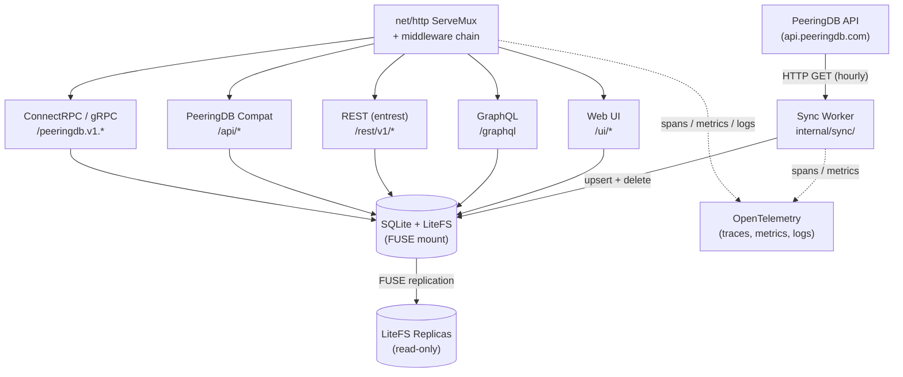
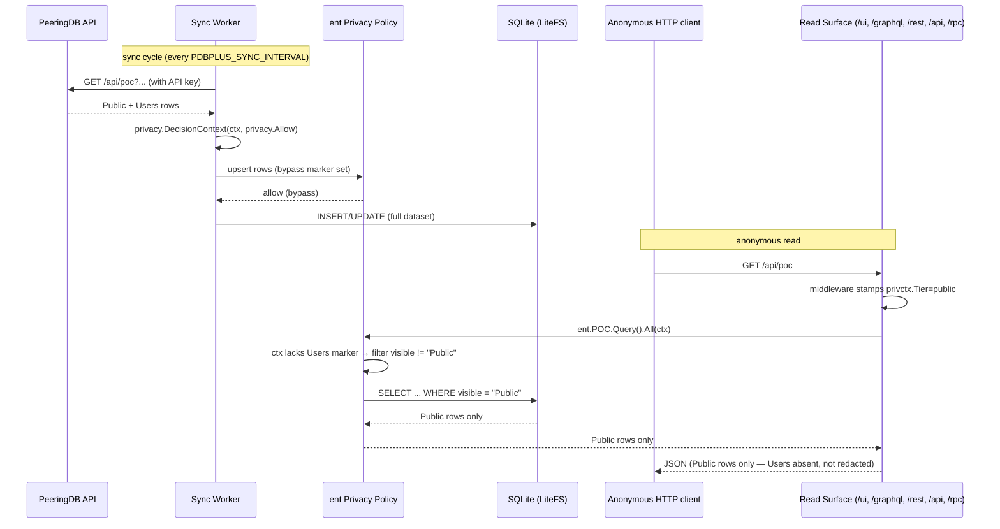

<!-- generated-by: gsd-doc-writer -->
# Architecture

## System overview

PeeringDB Plus is a globally distributed, read-only mirror of [PeeringDB](https://www.peeringdb.com)
data, implemented in Go. A single binary combines an in-process sync worker that periodically
re-fetches all PeeringDB objects with an HTTP server that exposes the mirrored data through five
coexisting API surfaces (Web UI, GraphQL, REST, a PeeringDB-compatible API, and ConnectRPC/gRPC).
Data is stored in SQLite, replicated to edge nodes by [LiteFS](https://fly.io/docs/litefs/), and
served with low latency from the nearest Fly.io region. Writes (schema migrations and data sync)
happen only on the LiteFS primary; all other instances are read-only replicas that can be promoted
at any time.

The architecture is heavily driven by [entgo](https://entgo.io/) code generation: a single set of
hand-edited schemas in `ent/schema/` drives generation of the database layer, the GraphQL server,
the REST server, and the ConnectRPC service definitions, keeping all API surfaces consistent with
the underlying data model.

## Component diagram



Only the node that currently holds the LiteFS lease (the primary) runs the sync worker's write
path. Replicas periodically re-check their role: on promotion, they begin syncing; on demotion,
they stop. Clients issuing write operations (the on-demand `POST /sync` trigger) are redirected
to the primary region via Fly.io's `fly-replay` header.

## Data flow

A typical read request flows as follows:

1. Fly.io terminates TLS at the edge and routes the request to the nearest healthy
   `peeringdb-plus` instance.
2. The Go HTTP server (`cmd/peeringdb-plus/main.go`) accepts the connection on `:8080` with HTTP/1.1
   and h2c (cleartext HTTP/2 for gRPC) enabled.
3. The middleware chain runs (`Recovery -> MaxBytesBody -> CORS -> OTel HTTP -> Logging ->
   Readiness -> SecurityHeaders -> CSP -> Caching -> Gzip`) before dispatching to the mux
   (`cmd/peeringdb-plus/main.go:593` — `buildMiddlewareChain`).
4. The request is dispatched to one of the five API surfaces based on URL path.
5. The handler reads from the local SQLite file via the ent client. Because SQLite is a local file
   (mounted through LiteFS FUSE), reads never leave the instance.
6. The response is serialized into the requested wire format (HTML, JSON, Protobuf, GraphQL,
   OpenAPI JSON) and passes back through the middleware chain for compression, caching headers, and
   OTel span completion.

The sync data flow (one cycle per `PDBPLUS_SYNC_INTERVAL`, default `1h`):

1. The scheduler in `internal/sync/worker.go` (`Worker.StartScheduler`, line 1264) wakes up and
   checks `IsPrimary()`. Replicas loop without syncing.
2. Phase A — fetch: the worker calls `api.peeringdb.com` for every object type using
   `internal/peeringdb/client.go`, accumulating all responses in memory scratch space
   (`internal/sync/scratch.go`).
3. A memory guardrail (`PDBPLUS_SYNC_MEMORY_LIMIT`, default `400MB`) aborts the sync if
   `runtime.MemStats.HeapAlloc` exceeds the ceiling before the transaction opens.
4. Phase B — apply: the worker opens a single ent transaction, upserts all rows, deletes rows no
   longer present in PeeringDB, and commits (`internal/sync/upsert.go`, `internal/sync/delete.go`).
   `PRAGMA defer_foreign_keys = ON` is set on the same connection to keep FK enforcement while
   allowing mid-transaction orphan handling.
5. The `OnSyncComplete` callback updates cached object-count metrics and the HTTP cache ETag, then
   the `sync_status` table row is persisted.
6. LiteFS replicates the SQLite WAL to all replica regions in the background; replicas pick up the
   new data on their next read without restarting.

## Key abstractions

- **`ent.Client`** (`ent/client.go`) — Generated ent client; the single entry point for all typed
  database access across every API surface.
- **`schema.*` schemas** (`ent/schema/organization.go`, `ent/schema/network.go`, and 12 others) —
  Hand-edited ent schema definitions annotated with entgql, entrest, and entproto directives. The
  source of truth that drives all code generation.
- **`peeringdb.Client`** (`internal/peeringdb/client.go`) — Rate-limit-aware HTTP client for
  `api.peeringdb.com`; returns a typed `RateLimitError` on HTTP 429 so the retry loop honors
  `Retry-After`.
- **`sync.Worker`** (`internal/sync/worker.go`) — Two-phase sync orchestrator with scheduler, retry
  backoff, primary gating, and memory guardrail.
- **`litefs.IsPrimaryWithFallback`** (`internal/litefs/primary.go:48`) — Primary detection with
  inverted-lease-file semantics and env var fallback for local dev.
- **`grpcserver.ListEntities[E, P]`** (`internal/grpcserver/generic.go:27`) — Generic paginated
  list helper parameterized over ent entity and proto message types; used by all 13 ConnectRPC
  services to avoid per-type duplication.
- **`middleware.CachingState`** (`internal/middleware/caching.go`) — Atomically swappable ETag
  keyed on the last successful sync completion time; one SHA-256 per sync, zero per request.
- **`pdbotel.SetupOutput`** (`internal/otel/provider.go`) — Bundles the OTel shutdown function and
  `LoggerProvider` so the dual slog handler can bridge log records into the OTel pipeline.
- **`chainConfig` / `buildMiddlewareChain`** (`cmd/peeringdb-plus/main.go:567, :593`) — Single
  construction point for the HTTP middleware stack; the wrap order is regression-locked by
  `TestMiddlewareChain_Order` in `middleware_chain_test.go`.

## Directory structure rationale

The project follows the standard Go layout (`cmd/` for binaries, `internal/` for non-exported
packages) with additional top-level directories for generated code and proto sources.

```
cmd/
  peeringdb-plus/       # Main binary: HTTP server, sync worker wiring
  pdb-schema-extract/   # Parses PeeringDB Django source into schema/peeringdb.json
  pdb-schema-generate/  # Generates ent/schema/*.go from schema/peeringdb.json
  pdbcompat-check/      # Validates PeeringDB-compatibility responses
ent/
  schema/               # Hand-edited ent schemas (entgql/entrest/entproto annotated)
  entc.go               # Code-generation driver (runs ent + extensions + go:linkname patches)
  generate.go           # go:generate directives (ent + buf)
  rest/                 # Generated entrest HTTP handlers
  ...                   # Generated ent query/mutation code (one pkg per entity)
gen/
  peeringdb/v1/         # Generated proto Go + ConnectRPC interfaces (from buf generate)
graph/                  # Generated gqlgen GraphQL server + hand-written resolvers
proto/
  peeringdb/v1/
    v1.proto            # Generated by entproto (messages)
    services.proto      # Hand-written RPC service definitions
    common.proto        # Hand-written shared types (e.g., SocialMedia)
schema/
  peeringdb.json        # Intermediate PeeringDB schema used by pdb-schema-generate
  generate.go           # go:generate directive for schema regeneration
internal/
  config/               # Env-var config loading, validation, fail-fast (CFG-1)
  database/             # SQLite open + ent client setup (WAL, FKs, busy timeout)
  litefs/               # Primary/replica detection
  peeringdb/            # PeeringDB API client (rate-limiting, Retry-After parsing)
  sync/                 # Sync worker, scheduler, two-phase apply, sync_status table
  otel/                 # TracerProvider, MeterProvider, LoggerProvider setup + metrics
  middleware/           # Recovery, CORS, logging, CSP, caching, gzip, etc.
  graphql/              # gqlgen handler wiring (complexity/depth limits, playground)
  grpcserver/           # ConnectRPC handlers (13 entities + generic + pagination)
  pdbcompat/            # Drop-in PeeringDB-compatible /api/ surface
  web/                  # templ + htmx Web UI (handlers, templates, termrender)
  health/               # /healthz and /readyz probes
  httperr/              # RFC 9457 Problem Details responses
  conformance/          # API-surface conformance tests
  testutil/             # Test helpers + deterministic seed data
testdata/
  fixtures/             # 13 JSON files matching PeeringDB API response shapes
deploy/                 # Deployment-adjacent assets
```

## Code generation pipeline

`go generate ./...` runs the full pipeline in dependency order:

1. **`ent/generate.go`** first invokes `go run entc.go` (`ent/entc.go`), which:
   - Patches `go-openapi/inflect` and ent's internal inflect rules via `go:linkname` to fix
     `"campus"` -> `"campu"` mangling.
   - Configures three ent extensions:
     - `entgql` — emits `graph/schema.graphqls` and `graph/gqlgen.yml` with Relay spec + where
       inputs.
     - `entrest` — emits an OpenAPI-compliant HTTP handler at `ent/rest/`, read-only operations
       (`OperationRead`, `OperationList`) by default.
     - `entproto` — emits proto message definitions into `proto/peeringdb/v1/v1.proto`.
   - Enables the `sql/upsert` and `sql/execquery` ent features (required by the sync worker's bulk
     upsert and per-connection `PRAGMA` execution).

2. `ent/generate.go` then runs `go tool buf generate` at the repo root, which reads `buf.gen.yaml`
   and invokes `protoc-gen-go` + `protoc-gen-connect-go` to emit Go types and ConnectRPC service
   interfaces under `gen/peeringdb/v1/`.

3. **`internal/web/templates/generate.go`** runs `go tool templ generate` to produce the
   type-safe `*_templ.go` files from `.templ` sources.

4. **`schema/generate.go`** runs `pdb-schema-generate` against `schema/peeringdb.json` to
   regenerate `ent/schema/*.go`. This step is re-runnable but strips entproto annotations, so it
   should not be run after those annotations are hand-edited into the schemas — see
   [CLAUDE.md](../CLAUDE.md) for the conventions around this.

`buf`, `templ`, and `gqlgen` are declared as Go tool dependencies (`go tool buf`, `go tool templ`,
`go tool gqlgen`) and do not require external installation.

## Middleware chain

The HTTP middleware stack is assembled by `buildMiddlewareChain`
(`cmd/peeringdb-plus/main.go:593`). Outermost first:

1. **Recovery** — Catches panics, logs them, and returns a 500.
2. **MaxBytesBody** — Caps non-gRPC request bodies at 1 MB (`maxRequestBodySize`). ConnectRPC and
   gRPC paths are skipped via a hardcoded prefix list to preserve streaming.
3. **CORS** — Configurable via `PDBPLUS_CORS_ORIGINS` (default `*`).
4. **OTel HTTP** — `otelhttp.NewMiddleware("peeringdb-plus")` adds a server span per request and
   exports the standard `http.server.*` metrics.
5. **Logging** — Structured slog access log with request ID correlation.
6. **Readiness** — Returns 503 for all routes except `/sync`, `/healthz`, `/readyz`, `/`,
   `/favicon.ico`, `/static/*`, and `/grpc.health.v1.Health/*` until the first sync completes.
   Browser clients get a styled HTML syncing page; terminal clients get plain text; everything
   else gets JSON.
7. **SecurityHeaders** — HSTS (180-day default), `X-Content-Type-Options: nosniff`, and
   `X-Frame-Options: DENY` scoped to browser paths.
8. **CSP** — Different policies for `/ui/` and `/graphql`. Served as `Report-Only` by default;
   switched to enforcing via `PDBPLUS_CSP_ENFORCE=true`.
9. **Caching** — ETag-based conditional GETs keyed on the last sync completion time. `/ui/about`
   is opted out because it renders relative timestamps that would freeze under a sync-time key.
10. **Gzip** — Response compression (innermost).
11. **mux** — The `net/http` ServeMux dispatches to the specific handler.

Response-writer wrappers in every middleware must implement `http.Flusher` (for gRPC streaming)
and provide `Unwrap() http.ResponseWriter` for middleware-aware interface detection. The wrap
order is regression-locked by `TestMiddlewareChain_Order` in
`cmd/peeringdb-plus/middleware_chain_test.go`.

## API surfaces

All five surfaces are mounted on the same mux in `cmd/peeringdb-plus/main.go` and read from the
same ent client:

- **Web UI — `/ui/*`** (`internal/web/`) — templ-rendered HTML + htmx (no JS build toolchain).
  Served by `(*Handler).dispatch` in `internal/web/handler.go:66`. `/static/*` serves bundled
  assets. `GET /` content-negotiates between terminal, browser, and JSON clients via
  `internal/web/termrender/`.

- **GraphQL — `/graphql`** (`internal/graphql/`, `graph/`) — `GET` serves the GraphiQL playground;
  `POST` runs queries through the gqlgen handler produced by entgql. Resolvers are in
  `graph/*.resolvers.go`; complexity and depth limits are applied in `pdbgql.NewHandler`.

- **REST — `/rest/v1/*`** (`ent/rest/`) — OpenAPI-compliant handler generated by entrest.
  Read-only by default (`OperationRead` + `OperationList`). Error responses are rewritten into
  RFC 9457 Problem Details by `restErrorMiddleware`
  (`cmd/peeringdb-plus/main.go:495`).

- **PeeringDB-compatible — `/api/*`** (`internal/pdbcompat/`) — Drop-in replacement for the
  PeeringDB API shape, including `depth` expansion, filter parameters, and the canonical response
  envelope. Uses a type registry (`internal/pdbcompat/registry.go`) to dispatch by object type.

- **ConnectRPC / gRPC — `/peeringdb.v1.*`** (`internal/grpcserver/`, `gen/peeringdb/v1/`) — All 13
  entity types expose `Get`, `List`, and `Stream` RPCs. Handlers are registered in a loop at
  `cmd/peeringdb-plus/main.go:326` wrapped with `otelconnect.NewInterceptor`. Server reflection
  (`grpcreflect.NewHandlerV1`/`V1Alpha`) and a health check (`grpchealth.NewStaticChecker`) are
  served on the same mux, so both `grpcurl` and gRPC health clients work against the running
  server. The health check is held in `NOT_SERVING` until the first sync completes, then flips to
  `SERVING` for the root service and every registered service name.

## Privacy layer

PeeringDB tags per-row visibility (`visible="Public" | "Users" | "Private"`
on POCs; see [CONFIGURATION.md §Privacy & Tiers](./CONFIGURATION.md#privacy--tiers)
for the end-to-end model). PeeringDB Plus honours this upstream visibility
through an ent Privacy policy wired in `ent/entc.go`. The inversion is the
non-obvious part: **the sync worker writes the full dataset (bypass); every
read path applies the filter (policy).**

The pieces:

1. **Request context stamping** (`internal/privctx/` — `privctx.Tier`,
   `privctx.WithTier`, `privctx.TierFrom`). A dedicated HTTP middleware
   (`internal/middleware/` privacy-tier middleware) inspects the incoming
   request, reads `PDBPLUS_PUBLIC_TIER` from config, and stamps a
   `privctx.Tier` value on the request context. The middleware sits in the
   chain before any handler dispatch, so every one of the five API surfaces
   inherits the tier via `r.Context()`.
2. **ent Privacy policy** (`entgo.io/ent/privacy`, feature `privacy` enabled
   in `ent/entc.go`). The POC entity (`ent/schema/networkcontact.go`) has a
   `Policy()` method whose query rule rejects rows with
   `visible != "Public"` unless the context carries a Users-tier marker.
   The policy is evaluated on every ent query; the five read surfaces
   (`/ui/`, `/graphql`, `/rest/v1/`, `/api/`, `/peeringdb.v1.*`) all flow
   through the same `ent.Client`, so there is exactly one filter, not five.
3. **Sync-worker bypass** (`internal/sync/worker.go`,
   `internal/sync/upsert.go`). The sync worker wraps its ent client calls
   in `privacy.DecisionContext(syncCtx, privacy.Allow)`. This marker
   short-circuits the policy so writes land the full dataset —
   `Users`-tier rows go into the DB — regardless of the caller tier that
   would otherwise apply. A single-call-site audit test (phase 59) keeps
   the bypass scoped to the worker.
4. **Observability** (phase 61). Startup logs a `sync.classification` line
   (`auth=authenticated|anonymous`). A WARN line
   (`privacy.override.active`) fires whenever `PDBPLUS_PUBLIC_TIER=users`.
   Read-path spans carry an OTel attribute `pdbplus.privacy.tier` with
   value `public` or `users`, usable as a Grafana dashboard filter.

### Sync write vs anonymous read — sequence diagram



All five read surfaces share this flow. Custom per-surface logic is not
needed: the middleware stamps the tier once, and ent's policy enforcement
fires on every generated query, so adding or removing a surface has no
effect on the privacy boundary.

Operator control surface:

- `PDBPLUS_PEERINGDB_API_KEY` — set to enable authenticated sync; absence
  is still supported (no `Users`-tier rows reach the DB, the filter is a
  no-op).
- `PDBPLUS_PUBLIC_TIER=users` — elevate anonymous callers to Users-tier for
  private-instance deployments. Logged with WARN at startup;
  `pdbplus.privacy.tier=users` on read spans.

See [CONFIGURATION.md](./CONFIGURATION.md#privacy--tiers) and
[DEPLOYMENT.md](./DEPLOYMENT.md#authenticated-peeringdb-sync-recommended)
for the operator-facing rollout.

## LiteFS primary/replica detection

LiteFS uses an *inverted* lease file: the presence of `/litefs/.primary` indicates a *replica*
(the file contains the primary's hostname), and its *absence* indicates the *primary*
(`internal/litefs/primary.go:12` — `PrimaryFile`).

`IsPrimaryWithFallback(path, envKey)` (`internal/litefs/primary.go:48`) checks three conditions in
order:

1. If `/litefs/.primary` exists, this node is a replica (`false`).
2. If `/litefs/` (the parent directory) exists, LiteFS is mounted and no primary file means this
   node holds the lease (`true`).
3. Otherwise (no LiteFS at all — typical in local dev), parse the `PDBPLUS_IS_PRIMARY` env var
   (default `true`).

Primary status is checked *live* on every scheduler tick (`cmd/peeringdb-plus/main.go:107` —
`isPrimaryFn`), so LiteFS-driven promotions and demotions take effect without a process restart.
The sync worker's scheduler also handles role transitions: promoted replicas begin running sync
cycles; demoted primaries stop.

The on-demand sync endpoint (`POST /sync`) uses `IsPrimaryFn` to decide whether to run the sync
locally, return a Fly.io `fly-replay` header pointing at `PRIMARY_REGION`, or 503 in local dev
(`cmd/peeringdb-plus/main.go:674` — `newSyncHandler`). Fly.io handles the replay; the app itself
does not forward HTTP traffic.

The app listens directly on `:8080` with h2c enabled and does **not** sit behind the LiteFS proxy,
because the proxy does not handle HTTP/2 streaming RPCs. LiteFS runs as a separate FUSE process
whose mount point is inspected by the detection code above.

## OpenTelemetry instrumentation

OTel is set up once at startup in `internal/otel/provider.go` (`Setup`). Three signal providers
are configured via the OpenTelemetry autoexport package, which reads standard `OTEL_*` env vars
to select exporters (OTLP, stdout, none):

- **`TracerProvider`** — Sampler is `TraceIDRatioBased(PDBPLUS_OTEL_SAMPLE_RATE)` (default `1.0`).
  Spans are created automatically by `otelhttp` middleware for HTTP requests, by
  `otelconnect.NewInterceptor` for ConnectRPC RPCs, and by the sync worker for sync cycles.
  Ent schema hooks (`ent/runtime` imported for side effects in `cmd/peeringdb-plus/main.go:27`)
  emit mutation spans for every ent write.

- **`MeterProvider`** — Exposes standard `http.server.*` metrics (from otelhttp) and custom sync
  metrics registered in `internal/otel/metrics.go` (`InitMetrics`):
  - `pdbplus.sync.duration` (histogram) — buckets 1/5/10/30/60/120/300 seconds.
  - `pdbplus.sync.operations` (counter) — labelled by status (success/failed).
  - `pdbplus.sync.type.objects` (counter) — per-type object counts.
  - `pdbplus.sync.type.deleted` (counter) — per-type delete counts.
  - `pdbplus.sync.type.fetch_errors` / `upsert_errors` / `fallback` (counters).
  - `pdbplus.role.transitions` (counter) — LiteFS promote/demote events.
  - Object-count gauges per type (`InitObjectCountGauges`) backed by an atomic cache updated on
    every successful sync, avoiding live `COUNT(*)` queries.
  - A freshness gauge (`InitFreshnessGauge`) derived from the `sync_status` table.

  Two explicit views reshape instruments for cost control: `http.server.request.body.size` is
  dropped (low debugging value, high cardinality), and `rpc.server.duration` buckets are capped at
  a 5-boundary set. The metric resource also omits `fly.machine_id` to prevent per-VM metric
  fan-out, while traces and logs keep it for per-VM debugging.

- **`LoggerProvider`** — The stdlib `log/slog` logger is wrapped in a *dual handler*
  (`pdbotel.NewDualLogger` in `internal/otel/logger.go`) that writes to stdout *and* bridges
  records into the OTel log pipeline simultaneously. Setting it as the default with
  `slog.SetDefault` means every `slog.Info/Warn/Error` call throughout the codebase emits both a
  human-readable stdout line and an OTel log record without per-call adaptation.

Standard runtime metrics are collected via `go.opentelemetry.io/contrib/instrumentation/runtime`
(wired through `internal/otel/provider.go`). All providers are shut down on SIGINT/SIGTERM via the
`SetupOutput.Shutdown` closure, which runs inside the drain window
(`PDBPLUS_DRAIN_TIMEOUT`, default `10s`).
