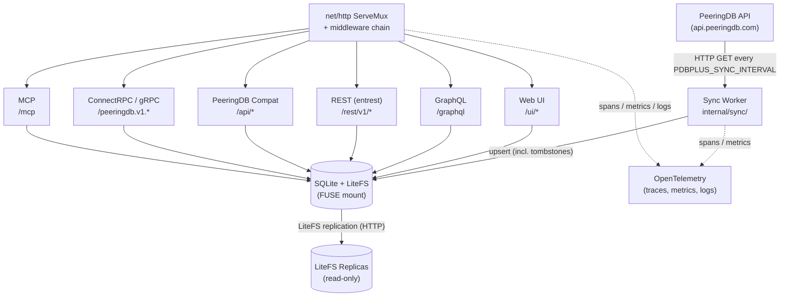
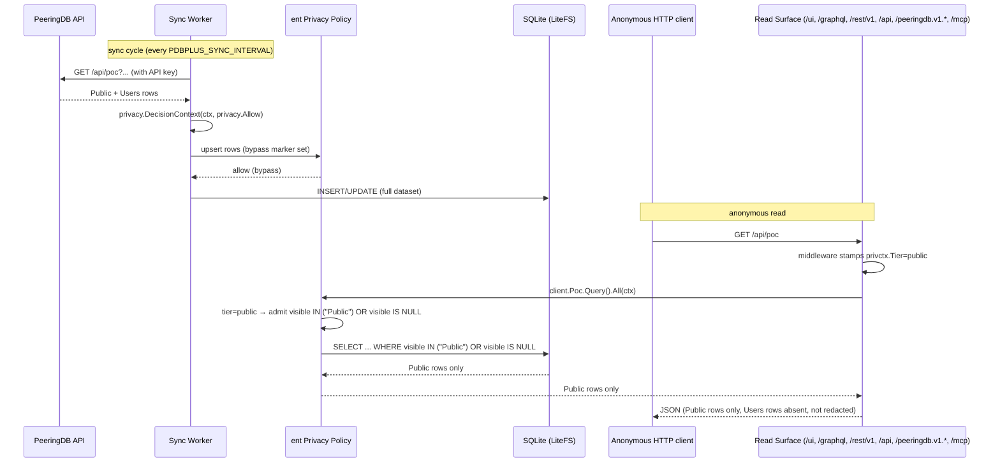

# Architecture

## System overview

PeeringDB Plus is a globally distributed, read-only mirror of [PeeringDB](https://www.peeringdb.com) data, implemented in Go.
A single binary runs an HTTP server and an in-process sync worker.
The HTTP server exposes the mirrored data through six coexisting API surfaces (Web UI, GraphQL, REST, a PeeringDB-compatible API, ConnectRPC/gRPC, and MCP).
By default the worker fetches only the objects that changed upstream (`?since=`).
Once per `PDBPLUS_FULL_SYNC_INTERVAL` (default `24h`) it fetches every object.
Data is stored in SQLite, replicated to edge nodes by [LiteFS](https://fly.io/docs/litefs/), and served with low latency from the nearest Fly.io region.
Writes (schema migrations and data sync) happen only on the LiteFS primary.
Only a machine in `PRIMARY_REGION` can take the LiteFS lease (`lease.candidate` in `litefs.yml`).
Replicas in other regions stay read-only.

[entgo](https://entgo.io/) code generation drives most of the code.
`schema/peeringdb.json` is a hand-curated description of the 13 PeeringDB types.
`cmd/pdb-schema-generate` writes `ent/schema/{type}.go` from it, and entc generates the database layer, the GraphQL server and the REST server from those schemas.
Hand-written schema methods live in sibling files that the generator does not touch.

## Component diagram


```mermaid
graph TD
    PDB["PeeringDB API<br/>(api.peeringdb.com)"]
    W["Sync Worker<br/>internal/sync/"]
    DB[("SQLite + LiteFS<br/>(FUSE mount)")]
    REP[("LiteFS Replicas<br/>(read-only)")]
    MUX["net/http ServeMux<br/>+ middleware chain"]
    WEB["Web UI<br/>/ui/*"]
    GQL["GraphQL<br/>/graphql"]
    REST["REST (entrest)<br/>/rest/v1/*"]
    COMPAT["PeeringDB Compat<br/>/api/*"]
    RPC["ConnectRPC / gRPC<br/>/peeringdb.v1.*"]
    MCP["MCP<br/>/mcp"]
    OTEL["OpenTelemetry<br/>(traces, metrics, logs)"]

    PDB -->|"HTTP GET every PDBPLUS_SYNC_INTERVAL"| W
    W -->|"upsert (incl. tombstones)"| DB
    DB -->|"LiteFS replication (HTTP)"| REP
    MUX --> WEB
    MUX --> GQL
    MUX --> REST
    MUX --> COMPAT
    MUX --> RPC
    MUX --> MCP
    WEB --> DB
    GQL --> DB
    REST --> DB
    COMPAT --> DB
    RPC --> DB
    MCP --> DB
    W -.->|"spans / metrics"| OTEL
    MUX -.->|"spans / metrics / logs"| OTEL
```

Only the node that currently holds the LiteFS lease (the primary) runs the sync worker's write path.
Replicas periodically re-check their role: on promotion, they begin syncing; on demotion, they stop.
Clients issuing write operations (the on-demand `POST /sync` trigger) are redirected to the primary region via Fly.io's `fly-replay` header.

## Data flow

A typical read request flows as follows:

1. Fly.io terminates TLS at the edge
   and routes the request to the nearest healthy `peeringdb-plus` instance.
2. The Go HTTP server (`cmd/peeringdb-plus/main.go`) accepts the connection on
   `:8080` with HTTP/1.1 and h2c (cleartext HTTP/2 for gRPC) enabled.
3. The middleware chain runs
   (`Recovery -> MaxBytesBody -> CORS -> OTel HTTP -> Recovery -> Logging -> PrivacyTier -> Readiness -> SecurityHeaders -> CSP -> Caching -> Gzip -> RouteTag`)
   before dispatching to the mux (`buildMiddlewareChain` in
   `cmd/peeringdb-plus/server.go`).
4. The request is dispatched to one of the six API surfaces based on URL path.
5. The handler reads from the local SQLite file via the ent client.
   Because SQLite is a local file (mounted through LiteFS FUSE), reads never leave the instance.
6. The response is serialized into the requested wire format
   (HTML, JSON, Protobuf, GraphQL, OpenAPI JSON)
   and passes back through the middleware chain for compression,
   caching headers, and OTel span completion.

The sync data flow (one cycle per `PDBPLUS_SYNC_INTERVAL`, default `1h` unauthenticated / `15m` authenticated):

1. The scheduler in `internal/sync/worker.go` (`Worker.StartScheduler`) wakes up and checks `IsPrimary()`.
   Replicas loop without syncing.
   On the primary, the worker inserts a `running` row into `sync_status`.
   Then it deletes up to 1000 rows that are older than the newest 3000 rows.
   It keeps the newest success row and the newest full success row.
   If the delete fails, the worker logs a WARN and the cycle continues.
2. Phase A — fetch: the worker calls `api.peeringdb.com` for every object type using `internal/peeringdb/client.go`, staging all responses in an on-disk SQLite scratch database (`internal/sync/scratch.go`) — deliberately spilled to disk to keep heap under the sync memory gate.
   The database is in `PDBPLUS_SCRATCH_DIR`, or in `os.TempDir()` when that is empty.
   On Fly.io it is on the primary volume, which is faster than the root file system.
   At scheduler start, the primary removes the scratch files that a crashed process left in a set `PDBPLUS_SCRATCH_DIR`.
   When that sweep does not run, the first cycle of the process runs it.
   The sweep needs the exclusive lock on `.pdbplus-scratch.lock` in the directory, and each process that stages a cycle there holds a shared lock.
   When a cycle cannot get the shared lock, it stages in `os.TempDir()`.
   It also stages in `os.TempDir()` when the directory has less than 512 MiB of free space, so the scratch file does not take the space that LiteFS needs on the primary volume.
3. A memory guardrail (`PDBPLUS_SYNC_MEMORY_LIMIT`, default `400MB`) aborts the
   sync if `runtime.MemStats.HeapAlloc` exceeds the ceiling before the
   transaction opens.
4. Phase B — apply: the worker opens a single ent transaction and upserts all rows (`internal/sync/upsert.go`), then commits.
   Sync does not infer a tombstone from a row that a list response leaves out.
   A row carries `status="deleted"` when upstream's `?since` response said so, or when it is a live netixlan of a deleted network that upstream no longer has (see [Soft-delete tombstones](#soft-delete-tombstones)).
   An upstream tombstone is an ordinary upsert whose `status` column is `deleted`.
   SQLite checks foreign keys per statement.
   The step order writes every parent type before its children.
   Before the upsert, `fkFilter` drops a row whose required parent is missing, and sets a nullable FK whose parent is missing to NULL.
   Phase B can also call upstream to fetch missing parent rows (see [FK backfill](#fk-backfill)).
5. The worker writes the `sync_status` row.
   Then the `OnSyncComplete` callback refreshes the object-count cache.
   The HTTP ETag does not use this callback; it follows the database version on every node (see [Middleware chain](#middleware-chain)).
6. LiteFS sends each committed transaction to the replicas over HTTP.
   Replicas read the new data without a restart.

### Incremental cursor

Each cycle reads one cursor per type before the first upstream request.
The cursor is the watermark of the type, a row of the `sync_watermark` table (`internal/sync/watermark.go`).
The worker clamps it to the newest `updated` value in the local table (`GetMaxUpdated`, `internal/sync/cursor.go`).
A table with rows and no watermark row uses that newest `updated` value.
This occurs once, in the first cycle after the upgrade, and the worker logs INFO `sync watermark missing, using MAX(updated)`.
An empty table has no cursor, whatever its watermark row holds.

In incremental mode, a type with rows fetches `?since=<cursor>` in pages of 250.
An empty table fetches the bare list, which holds only live rows.
When that list is not empty, the worker then fetches a `?since=` window from the newest `updated` value in the list.
If an incremental fetch fails, the worker deletes the rows of that type from the scratch staging database and fetches the bare list.
Then it tries the `?since=` window once more (see [Soft-delete tombstones](#soft-delete-tombstones)).
The `pdbplus.sync.type.fallback` counter records this. [meta-generated-behavior.md](./meta-generated-behavior.md) explains why the cursor does not use the `meta.generated` value of upstream responses.

The sync transaction writes the next watermark of each type before it commits, so a watermark commits and rolls back with the rows:

- The next watermark is the newest `updated` value in the table without the rows that FK backfill landed in the cycle.
  It is never earlier than the cursor of the cycle.
- A table that is still empty gets no watermark row.
  A table that was empty before the cycle and holds only rows that FK backfill landed gets the oldest `updated` value of those rows.
  Two backfill requests of one cycle can land rows at different times, so the newest of these rows can be later than a delete of an older one.
- A held cursor, one that is earlier than the newest row,
  keeps its watermark when the worker discarded the tombstone window
  of the type after a failed incremental fetch.

FK backfill can land a parent row that upstream changed after the fetch of the parent type in the same cycle.
Before the `sync_watermark` table, the cursor was the newest `updated` value, so it moved past the changes between that fetch and the backfilled row.
No later `?since=` fetch returned them, and a delete in that gap was lost.

The watermark leaves out the backfilled rows, so it is never later than the time of the fetch of the type.
The next cycle fetches the type from the watermark and gets the gap and the backfilled rows again.
The upsert of an unchanged row writes nothing.
The watermark then moves past them.
Without FK backfill, the watermark is the newest `updated` value, so the requests do not change.

When a cursor read fails, or a watermark is not a positive integer, the cycle fails before it sends a request and commits no synced rows.
The next cycle retries.
The worker never uses a different cursor after a read error.
The newest `updated` value would bring back the backfill gap.
A zero cursor would start the window at the newest row of the bare list, and a populated table would lose the deletes between the real cursor and that row.
A missing `sync_watermark` table is not an error: the worker uses the newest `updated` values, and the sync transaction creates the table.

Observability:

- The `sync-fetch-<type>` span has `pdbplus.sync.cursor` (RFC 3339),
  `pdbplus.sync.cursor.source` (`watermark`, `max_updated` or `empty`),
  and `pdbplus.sync.cursor.behind_seconds` for a held cursor.
- The root span has `pdbplus.sync.watermarks_written` and
  `pdbplus.sync.watermarks_held`, counted in the transaction.
- A held cursor logs INFO `sync cursor held behind newest row`
  before the first request.
- After the commit, a type whose watermark is earlier than its newest row logs INFO `sync watermark behind backfilled rows`, or WARN `sync watermark kept, tombstone window discarded`.
  When the WARN repeats for a type, the `?since=` requests of that type fail.

### Upstream requests

All upstream calls share one rate limiter (`internal/peeringdb/client.go`): `PDBPLUS_PEERINGDB_RPS` (default 1/3, 20 per minute) requests per second, or 30 requests per minute with an API key, with a burst of 1.
PeeringDB documents 20 queries per minute per IP for anonymous callers, 40 per minute per user or organization with a key, and asks for at least two seconds between queries.
The transport (`internal/peeringdb/transport.go`) handles these responses:

- HTTP 429 with a `Retry-After` of 60 seconds or less: the client waits and tries again, at most 3 attempts.
  A longer or absent `Retry-After` fails the request.
- HTTP 403 with a WAF body: the client does not try again.

The client tries a 500, 502, 503 or 504 response again with backoff, at most 3 attempts.
See [CONFIGURATION.md § Sync Worker](./CONFIGURATION.md#sync-worker) for the settings.

### FK backfill

Phase B can call upstream.
When a row points to a parent that is not in the database, the worker fetches the missing parents with `?since=1&id__in=<ids>`, 100 IDs per request, and also the missing parents of those parents (`internal/sync/fk_backfill.go`).
These calls run inside the open transaction.
A row that the backfill lands does not move the cursor of its type (see [Incremental cursor](#incremental-cursor)).
`PDBPLUS_FK_BACKFILL_MAX_REQUESTS_PER_CYCLE` (default 20, `0` disables backfill) and `PDBPLUS_FK_BACKFILL_TIMEOUT` (default `5m`) limit them.
The same cap setting also limits the netixlan cascade verification (see [Class B: verified against upstream](#class-b-verified-against-upstream)).
The worker drops the child row, or sets a nullable FK to `NULL`, in these cases:

- Backfill is off.
- A limit is reached.
- The fetch fails.
- Upstream does not return the parent.

For a facility, a missing campus also gets a backfill.
Before the first facility chunk, the worker reads the campus IDs of all staged facilities and fetches the missing campuses together (`prefetchStagedFacCampuses`), so the campuses do not use one request for each chunk from the cap that later types share.
The campus fetch still counts against that cap: one request for each 100 missing campuses, and none after the campuses are stored.
With a cap of 1, that request can leave no budget for a required parent of a later type, and the worker drops that row until the next full cycle.
When the backfill does not return the campus, the worker sets `campus_id` to `NULL` and keeps the facility (`nullOptionalFK` in `internal/sync/worker.go`).
A bare `/api/campus` list holds only `ok` campuses, so a pending campus that did not change since the first sync reaches the mirror only through this backfill.
A facility that the backfill itself lands is the exception.
When its campus is missing, the worker sets `campus_id` to `NULL` and does not try a backfill (`nullMissingOptionalFKs`).
The `pdbplus.sync.type.orphans` counter records each dropped row or `NULL` FK.

### History sweep

A bare list holds only live rows.
A `?since=<cursor>` window holds only the rows that changed after the cursor.
So a mirror that starts from bare lists never gets a row that upstream deleted before the first sync.
It also misses a pending campus that did not change after the first sync.
The history sweep (`internal/sync/history_sweep.go`) fetches these rows over many incremental cycles.
Each request is one id window:

```text
/api/<type>?since=1&status=deleted&id__gte=<from>&id__lt=<to>&depth=0
```

- The sweep does the types in sync step order, so parents land before their children.
  A cycle stops the sweep after the last window of a type, so the next type starts in a later cycle.
  By then the parent windows are committed, and the normal fetch of that cycle gets the parent rows that the cursor rule (below) dropped.
  So a swept row finds each parent that upstream returns in a `?since=` list, with no FK backfill request, unless the parent table is empty (see the limits below).
  It does the ids of each type in fixed-width windows (`historySpecs`).
- The widths keep each window of tombstones below about 0.9 MB.
  Upstream limits a repeated URL only after that URL returned 1 MB or more, and each window is a new URL.
- The last window of a type has no `id__lt`.
  It starts where a window would reach the largest stored id, so it also gets the ids above that id.
- `ix`, `ixlan`, `net` and `netixlan` windows add `hide_ix_no_fac=0`.
  This turns off the upstream filter that hides exchanges without a facility for a user who set that preference (2.83.0 `rest.py:1267-1297`).
- `campus` takes one request without `status=deleted`,
  so it also gets the pending campuses.
- `poc` is not swept.
  Upstream removes poc tombstones after 30 days, and the `?since=` windows of the normal cycles get them before that.

With the widths and id ranges of 2026-09-24, one sweep is 184 windows.
At the default of 15 windows per cycle, and with a stop at the end of each type, that is 21 incremental cycles: about 5.25 hours at the 15-minute authenticated interval.
The id gaps of 2026-09-24 give an upper bound of about 115,000 new tombstones.
The gaps also hold ids that upstream hard-deleted, so the real number is lower.
Before the sweep, the mirror held about 7,400 tombstones.

The sweep merges.
It never deletes a row:

- The windows stage into the scratch database after the normal fetch.
  Phase B upserts them in the same transaction as the rest of the cycle, with the incremental gate: a stored row changes only when the window row has a later `updated`.
- In scratch, a window row does not replace a row of the normal fetch
  that has a later `updated`.
- The sweep drops a window row whose `updated` is later than the newest `updated` value of its table before the cycle.
  Such a row can have changed after the normal fetch of the cycle, and its commit would move the next watermark past the other rows that changed in that gap.
  The next `?since=` fetch gets the row.
- A stored live row becomes a tombstone when upstream has a tombstone for it with a later `updated`.
  This repairs the rows that full cycles before v1.28.1 turned back into live rows.
  A bare list holds no tombstones, so the daily full cycle cannot repair them.
- A swept network tombstone with the RIR reclaim signature,
  for a network that the mirror does not have as deleted,
  starts class A of the netixlan cascade in the same cycle (see
  [Class A: RIR reclaim in this cycle](#class-a-rir-reclaim-in-this-cycle)).
- FK backfill applies to swept rows.
  A tombstone whose parent is missing uses the `PDBPLUS_FK_BACKFILL_MAX_REQUESTS_PER_CYCLE` cap that the rest of the cycle also uses.

Limits:

- `PDBPLUS_HISTORY_MAX_REQUESTS_PER_CYCLE` (default 15, `0` turns the sweep
  off) caps the windows of one cycle.
- The sweep runs only in incremental cycles.
  A full cycle skips it.
- The sweep skips a type whose table is empty, as in the first cycle of a new install, and does not mark it done.
  The later types go on.
  A later cycle sweeps the type after its table has rows.
  A required FK to an empty type means an empty child table.
  So only the nullable fac `campus_id` can point into an empty type, when upstream has no live campus.
  FK backfill fetches the campus of a swept fac, as for any fac, and the stored campus lets a later cycle sweep `campus`.
  With FK backfill off, the fac keeps a null `campus_id`, as on the normal fetch path.
- The worker does not send a window again within 65 minutes (`historyMemoTTL`).
  So the retries of a failed cycle (30 s, 2 m and 8 m) and a restart send no repeated URL.
  A window that is in the memo stops the sweep for that cycle.
- The first failed window stops the sweep.
  The windows before it keep their rows and their progress.
  A 429 or a WAF block logs WARN `history sweep stopped by upstream rate limit`.
  Another error logs WARN `history sweep stopped: window failed`.
  Neither fails the cycle.
  A fault of the scratch database fails the cycle.

Progress:

- The `sync_history_sweep` table has one row for each type that the sweep started: `type`, `next_id` (the first id of the next window), `done` and `updated_at`.
  `InitStatusTable` creates it.
- The sync transaction writes the progress, so a cycle that rolls back also rolls back its progress.
  A cycle that changes no progress writes nothing.
- When every type is done, the sweep sends no request.
  `POST /sync?mode=history` deletes the progress and runs an incremental cycle (never a full one) that starts again at the first window.
  Within 65 minutes of the first window, the memo holds the restart until the window expires.

Observability:

- Span `sync-history-sweep` with the attributes `pdbplus.sync.history.{restart,requests,rows,dropped,stop}`.
  `stop` is `budget`, `type_done`, `complete`, `memo`, `zero_cursor` (only types with an empty table are left), `rate_limited` or `error`.
- Counter `pdbplus.sync.history.requests{type,result}`,
  where `result` is `ok`, `rate_limited` or `error`.
- After the commit: INFO `history sweep progress`
  (`requests`, `rows`, `dropped`, `stop`, `next_type`, `next_id`)
  when the cycle sent a window, INFO `history sweep complete`
  when the last type is done, and INFO `history sweep restarted` (`stop`).

### Daily full reconcile

An incremental cycle fetches `?since=<cursor>` in pages of 250 rows, and its upserts skip a row whose `updated` value did not advance.
It cannot see a change that upstream makes without a new `updated` value.
Once per `PDBPLUS_FULL_SYNC_INTERVAL` (default `24h`), the cycle runs in full mode instead.
It fetches each bare list in one request and also rewrites rows whose `updated` value did not advance: the `withReconcileAll` marker relaxes the `updated` skip gate of the upserts from `>` to `>=` (`internal/sync/upsert.go`).
A full-mode upsert writes a row only when a column differs from the stored row.
SQLite writes the index entries of each updated column again, also when the value is the same.
Each replica applies a commit with the WAL locks held, so a rewrite of unchanged rows made each daily commit about as large as all the indexes of the database.
Only a full-mode cycle repairs this data:

- Count fields, such as `ix_count`, `net_count` and `fac_count`.
  Upstream saves them without a change to `updated` (2.83.0 `signals.py:92-177`).
- `name`, `city` and `country` on `netfac` and `ixfac`, and `name` on `carrierfac`.
  Upstream copies these values from the facility (2.83.0 `docs/api/obj_netfac.md:8-9`, `obj_ixfac.md:8-9`, `obj_carrierfac.md:12`), so a facility edit changes them without a change to the row's `updated`.
- Live rows that a paged `?since=` fetch skipped.
  Upstream orders the window by `updated` only and pages it with an offset (2.83.0 `rest.py:738-745`, `:757-760`).
  Rows that share one `updated` value can move across a page edge between two requests, and the cursor then moves past the rows that were skipped.
  Upstream migration `0160_netixlan_not_operational_status` gives about 600 netixlans one `updated` value.
- Values that upstream set before the mirror stored the field,
  for example `meta` on `net` and `netixlan`.
- FK columns that the sync set to `NULL` because the parent was missing,
  and a newly added `_fold` column.

With `PDBPLUS_FULL_SYNC_INTERVAL=0` this data stays stale until an operator runs `POST /sync?mode=full` with the `X-Sync-Token` header (`PDBPLUS_SYNC_TOKEN`).

Upstream serves the bare list from its API cache (2.83.0 `api_cache.py`, built by `pdb_api_cache`), which can be hours or days older than the data the mirror holds.
Two rules keep a stale snapshot from rolling rows back:

- The upserts keep a stored row whose `updated` value is newer than the snapshot's version and not older than the newest `updated` value in the snapshot.
  Such a row can have changed after upstream built the cache.
  A stored row older than the snapshot's newest row predates the snapshot, so the snapshot's version replaces it even when its `updated` value is older, for example after a raw save of an old version outside a revision.
  An IX-F import-log rollback gets a new `updated` value, because it runs in a revision and handleref saves the row again (2.83.0 `models.py:3745-3747`, django-handleref `models.py:9-16`).
- The window fetch that follows the snapshot starts at the earlier of the cursor and the newest `updated` value in the snapshot (see [Soft-delete tombstones](#soft-delete-tombstones)).
  Its `?since=` filter matches every row that changed after upstream built the cache.
  The window is paged like any `?since=` fetch, so rows that share one `updated` value can be skipped at a page edge, as described above.
  The next full cycle fetches them again.

These rules protect data that the mirror holds when the cycle starts.
A full cycle before v1.28.1 could turn an upstream delete back into a live row.
No later cycle returns such a row, because bare lists contain live rows only and the tombstone's `updated` value is behind every window.
The netixlan upsert also keeps a stored tombstone when the snapshot lists the row live with the same `updated` value.
Upstream changes `updated` on every real undelete, so only a stale cache sends that pair, except for a delete and an undelete in the same second (see [Netixlan cascade of deleted networks](#netixlan-cascade-of-deleted-networks)).

Each fetch span carries `pdbplus.sync.snapshot.generated`, `pdbplus.sync.snapshot.max_updated` and `pdbplus.sync.window.since`.
When the window of a populated table starts at the snapshot, the worker logs `INFO "window starts at full snapshot"` with `snapshot_lag`, the cursor minus the snapshot's newest `updated` value.
That is normal after any change since upstream built its cache, or when the newest stored row is a tombstone.
A large `snapshot_lag`, or an old `snapshot_generated`, shows a stale cache.

### Lock-error retry of short writes

On the LiteFS primary, a commit can fail when SQLite cannot get a lock.
On 2026-09-24 the startup netixlan cascade commit failed with `locking protocol (15)`.
`retryOnLock` (`internal/sync/lockretry.go`) runs these short writes again:

- The `sync_status` INSERT at the start of a cycle.
- The `sync_status` UPDATE at the end of a cycle, for a success and for a
  failure.
- The startup `ReapStaleRunningRows` UPDATE.
- The startup poc contact scrub transaction.
- The startup netixlan cascade transaction.
  The verification requests run once, before the first attempt.

The main sync transaction and the `sync_status` prune do not retry.
The fetch pass of the sync transaction is expensive, and the next cycle does the work of both again.

A retry starts only for a `modernc.org/sqlite` error whose primary code (`code & 0xff`) is `SQLITE_BUSY` (5) or `SQLITE_PROTOCOL` (15).
The extended codes of `SQLITE_BUSY`, such as `SQLITE_BUSY_SNAPSHOT` (517), also retry.
`busy_timeout` does not wait for `SQLITE_PROTOCOL` or `SQLITE_BUSY_SNAPSHOT`.
`SQLITE_LOCKED` (6) does not retry.
It comes from a conflict in one connection or in a shared cache, and production does not use a shared cache.
Other errors do not retry.

The policy (`LockRetry`) is 4 attempts, with waits of 250ms, 500ms and 1s.
The worker and `cmd/peeringdb-plus` pass it as a value.
A wait stops when the context is done.
Each write is safe to run again.
A failed INSERT adds no row.
The UPDATEs set the same values, or select only the rows that still need the change.
A failed attempt leaves no open transaction on its pooled connection.
The caller rolls back after a failed statement.
When a COMMIT fails and SQLite keeps the transaction open, `modernc.org/sqlite` rolls it back before `database/sql` returns the connection to the pool.

Each retry logs `WARN "retrying write after sqlite lock error"` with `op`, `attempt`, `max_attempts`, `delay` and `error`, and adds 1 to `pdbplus.sync.lock_retries{op}`.
The `op` values are `record_sync_start`, `record_sync_complete`, `reap_stale_running_rows`, `startup_poc_scrub` and `startup_netixlan_cascade`.
When the last attempt fails, the caller logs its usual failure line.

## Key abstractions

- **`ent.Client`** (`ent/client.go`) — Generated ent client;
  the single entry point for all typed database access across every API surface.
- **ent schemas** (`ent/schema/`): `{type}.go` files that `cmd/pdb-schema-generate` writes from `schema/peeringdb.json`.
  Do not edit them.
  Hand-written methods live in sibling files (`poc_policy.go`, `{type}_fold.go`, `fold_mixin.go`, `campus_annotations.go`, `pdb_allowlists.go`, `hooks.go`).
- **`peeringdb.Client`** (`internal/peeringdb/client.go`) —
  Rate-limit-aware HTTP client for `api.peeringdb.com`;
  returns a typed `RateLimitError` on HTTP 429
  so the retry loop honors `Retry-After`.
- **`sync.Worker`** (`internal/sync/worker.go`) —
  Two-phase sync orchestrator with scheduler, retry backoff, primary gating,
  and memory guardrail.
- **`litefs.IsPrimaryWithFallback`** (`internal/litefs/primary.go`) —
  Primary detection with inverted-lease-file semantics,
  a lease-candidate check (`litefs.IsCandidate`),
  and env var fallback for local dev.
- **`grpcserver.ListEntities[E, P]`** (`internal/grpcserver/generic.go`): Generic paginated list helper parameterized over ent entity and proto message types; used by all 13 ConnectRPC services to avoid per-type duplication.
  The companion `StreamEntities[E, P]` (same file) streams rows in keyset batches.
- **`middleware.CachingState`** (`internal/middleware/caching.go`): an ETag keyed on the local database version, held behind an atomic pointer.
  It costs one SHA-256 for each version change and none for each request.
  The ETag watcher (`cmd/peeringdb-plus/etag.go`) updates it on every node (see [Middleware chain](#middleware-chain)).
- **`pdbotel.SetupOutput`** (`internal/otel/provider.go`) —
  Bundles the OTel shutdown function and `LoggerProvider`
  so the dual slog handler can bridge log records into the OTel pipeline.
- **`chainConfig` / `buildMiddlewareChain`** (`cmd/peeringdb-plus/server.go`):
  Single construction point for the HTTP middleware stack;
  the wrap order is regression-locked by `TestMiddlewareChain_Order` in
  `middleware_chain_test.go`.
- **`privfield.Redact`** (`internal/privfield/`) — Single source of truth for field-level redaction.
  Every API serializer that exposes a gated field (e.g. `ixlan.ixf_ixp_member_list_url`) calls `Redact(ctx, visible, value) (out string, omit bool)`; unstamped contexts fail-closed to `TierPublic`.
- **`unifold.Fold`** (`internal/unifold/unifold.go`) — Diacritic-insensitive folding (NFKD + ligature map) used to populate the 16 `<field>_fold` shadow columns spread across 6 entity types.
  The pdbcompat filter layer routes `__contains` / `__startswith` predicates to these shadow columns for parity with upstream PeeringDB's `unidecode` behaviour.

## Directory structure rationale

The project follows the standard Go layout (`cmd/` for binaries, `internal/` for non-exported packages) with additional top-level directories for generated code and proto sources.

```text
cmd/
  peeringdb-plus/         # Main binary: HTTP server, sync worker wiring
  pdb-schema-extract/     # Drift check: extracts a schema from upstream Django source
                          # for comparison with schema/peeringdb.json
  pdb-schema-generate/    # Generates ent/schema/*.go from schema/peeringdb.json
  pdb-compat-allowlist/   # Generates internal/pdbcompat/allowlist_gen.go (cross-entity traversal allowlist)
  pdbcompat-check/        # Validates PeeringDB-compatibility responses
  loadtest/               # Operator load generator (not in prod images)
ent/
  schema/                 # Generated ent schemas + hand-written sibling files
                          # (*_fold.go, *_policy.go, fold_mixin.go, pdb_allowlists.go)
  schematypes/            # JSON value types for ent fields
  templates/              # entrest template override (sorting)
  entc.go                 # Code-generation driver (runs ent + extensions + go:linkname patches)
  generate.go             # go:generate directives (schema, entc, allowlist, buf)
  rest/                   # Generated entrest HTTP handlers
  ...                     # Generated ent query/mutation code (one pkg per entity)
gen/
  peeringdb/v1/           # Generated proto Go + ConnectRPC interfaces (from buf generate)
graph/                    # Generated gqlgen GraphQL server + hand-written resolvers
proto/
  peeringdb/v1/
    v1.proto              # Hand-maintained messages (first generated by entproto)
    services.proto        # Hand-written RPC service definitions
    common.proto          # Hand-written shared types (e.g., SocialMedia)
schema/
  peeringdb.json          # Hand-curated schema, input to pdb-schema-generate
  generate.go             # package doc for extraction (schema regen runs from ent/generate.go)
scripts/                  # Upstream comparison scripts
internal/
  agentdocs/              # Agent skill, well-known files, llms.txt
  buildinfo/              # Build version string (Go VCS stamp or VERSION override)
  catalog/                # Shared queries for Web UI and MCP
  config/                 # Env-var config loading, validation, fail-fast
  database/               # SQLite open + ent client setup (WAL, FKs, busy timeout)
  litefs/                 # Primary/replica detection
  maptiles/               # Browser basemap config validation
  mcpserver/              # MCP server at /mcp
  pdbtypes/               # The 13 type names (leaf package)
  peeringdb/              # PeeringDB API client (rate-limiting, Retry-After parsing)
  sync/                   # Sync worker, scheduler, two-phase apply, sync_status table
  otel/                   # TracerProvider, MeterProvider, LoggerProvider setup + metrics
  middleware/             # Recovery, CORS, logging, CSP, caching, gzip, privacy_tier, etc.
  graphql/                # gqlgen handler wiring (complexity/depth limits, playground)
  grpcserver/             # ConnectRPC handlers (13 entities + generic + pagination)
  pdbcompat/              # Drop-in PeeringDB-compatible /api/ surface (incl. parity tests)
  privctx/                # Privacy tier in request context (TierFrom reader)
  privfield/              # Field-level redaction single source of truth (Redact)
  unifold/                # Diacritic-insensitive folding for shadow columns
  visbaseline/            # Visibility baseline + schema-alignment regression test
  web/                    # templ + htmx Web UI (handlers, templates, termrender)
  health/                 # /healthz and /readyz probes
  httperr/                # RFC 9457 Problem Details responses
  conformance/            # JSON structure comparison for compatibility checks
  testutil/               # Test helpers + deterministic seed data (seed/)
testdata/
  fixtures/               # 13 JSON files matching PeeringDB API response shapes
  visibility-baseline/    # Visibility baseline captures
deploy/                   # Deployment-adjacent assets (Grafana dashboards, alerts)
```

## Code generation pipeline

`go generate ./...` runs the four steps below.
A schema change converges in a **single pass**, because `ent/generate.go` runs the schema producer ahead of its consumer (entc).
A Tailwind class removal can need a second run (see after step 4).

1. **`ent/generate.go`** runs four directives in order:
   1. `pdb-schema-generate` (run first) regenerates `ent/schema/{type}.go` from `schema/peeringdb.json`.
      This step is re-runnable.
      Hand-written methods live in sibling files (for example `poc_policy.go` and `network_fold.go`) that the generator does not touch.
      See [Sibling-file convention](DEVELOPMENT.md#sibling-file-convention-load-bearing) for the rules.
      It is sequenced here, ahead of entc, rather than under `schema/`, because `go generate ./...` visits `ent/` before `schema/` and could not otherwise guarantee the producer runs before the consumer.
   2. `go run entc.go` (`ent/entc.go`), which:
      - Patches `go-openapi/inflect`
        and ent's internal inflect rules via `go:linkname` to fix `"campus"` ->
        `"campu"` mangling.
      - Configures three ent extensions:
        - `entgql` — emits `graph/schema.graphqls`
          and `graph/gqlgen.yml` with Relay spec + where inputs.
        - `entrest` — emits an OpenAPI-compliant HTTP handler at `ent/rest/`,
          read-only operations (`OperationRead`, `OperationList`) by default.
        - `entproto` — configured with `SkipGenFile`, but no ent schema carries an entproto annotation, so it writes nothing.
          `proto/peeringdb/v1/v1.proto` is hand-maintained since v1.6.
      - Enables the `sql/upsert`, `sql/execquery`, and `privacy` ent features
        (required by the sync worker's bulk upsert,
        per-connection `PRAGMA` execution,
        and the POC privacy policy respectively).
   3. `cmd/pdb-compat-allowlist` regenerates
      `internal/pdbcompat/allowlist_gen.go` from `schema.PrepareQueryAllows`
      declared in `ent/schema/pdb_allowlists.go` (the cross-entity traversal
      allowlist).
   4. `buf generate` at the repo root reads `buf.gen.yaml`
      and invokes `protoc-gen-go` + `protoc-gen-connect-go` to emit Go types
      and ConnectRPC service interfaces under `gen/peeringdb/v1/`.

2. **`graph/generate.go`** runs `gqlgen generate` to produce the GraphQL
   resolvers and models from `graph/schema.graphqls` + `graph/gqlgen.yml`.

3. **`internal/web/static.go`** runs `tailwindcss` to build
   `internal/web/static/tailwind.css` from `internal/web/tailwind.input.css`.

4. **`internal/web/templates/generate.go`** runs `templ generate` to
   produce the type-safe `*_templ.go` files from `.templ` sources.

`go generate ./...` visits the packages in import-path order, so step 3 runs before step 4.
Tailwind scans every file in `internal/web/templates`, which includes the generated `*_templ.go` files.
If a `.templ` change removes the last use of a class, step 3 still finds the class in the old `*_templ.go` file.
Run `go generate ./...` a second time to remove the class from `tailwind.css`.

`schema/generate.go` carries no `go:generate` directive.
`cmd/pdb-schema-extract <peeringdb-src>` is a manual drift check and is not part of `go generate ./...`.
It extracts a schema from the upstream Django source and writes it to stdout.
Compare that output with `schema/peeringdb.json` and apply real drift to `schema/peeringdb.json` by hand.
Do not overwrite the curated file with the output.
With `--validate`, the tool also compares the field names with sample responses from `beta.peeringdb.com`.

Mise installs `buf`, `templ`, `gqlgen`, `tailwindcss`, `protoc-gen-go` and `protoc-gen-connect-go` from `mise.toml` and `mise.lock`.

## Middleware chain

The HTTP middleware stack is assembled by `buildMiddlewareChain` (`cmd/peeringdb-plus/server.go`).
Outermost first:

1. **Recovery** (outer, `internal/middleware/recovery.go`):
   returns a 500 for a panic in MaxBytesBody, CORS or OTel HTTP.
2. **MaxBytesBody** (`internal/middleware/maxbody.go`) — Caps non-gRPC request bodies at 1 MB (`maxRequestBodySize`).
   ConnectRPC and gRPC paths are skipped via a hardcoded prefix list to preserve streaming.
3. **CORS** (`internal/middleware/cors.go`) —
   Configurable via `PDBPLUS_CORS_ORIGINS` (default `*`).
4. **OTel HTTP**: `otelhttp.NewMiddleware("peeringdb-plus")` creates a server span for each request and records the standard `http.server.*` metrics.
   It treats every request as a public endpoint, so each request starts a new root span.
   A `traceparent` from the client becomes a span link, so a client cannot set the trace ID or the sampling decision.
5. **Recovery** (inner, `internal/middleware/recovery.go`): catches panics, logs them, and returns a 500.
   It sits inside OTel HTTP because otelhttp records the request metric only when its inner handler returns: the 500 of a recovered panic is then counted, with its route.
   A panic after the handler started the response records the status already sent.
   A panic in a middleware before the mux dispatch has no `http_route`.
6. **Logging** (`internal/middleware/logging.go`): structured slog access log.
   Each line has `trace_id` and `span_id` when the span is valid.
7. **PrivacyTier** (`internal/middleware/privacy_tier.go`): stamps the resolved `PDBPLUS_PUBLIC_TIER` value onto every inbound request context via `privctx.WithTier`.
   Sits between Logging and Readiness so even the Readiness 503 path carries the tier; downstream ent privacy policies and `privfield.Redact` callers consume it via `privctx.TierFrom(ctx)`.
8. **Readiness**: returns 503 for all routes except `/sync`, `/healthz`, `/readyz`, `/`, `/favicon.ico`, `/static/*`, and `/grpc.health.v1.Health/*` until the first sync completes.
   Browser clients get a styled HTML syncing page; terminal clients get plain text; everything else gets JSON.
9. **SecurityHeaders** (`internal/middleware/security.go`) sets these headers on every response: `Strict-Transport-Security: max-age=31536000; includeSubDomains` (365 days), `X-Content-Type-Options: nosniff`, `Referrer-Policy: strict-origin-when-cross-origin`, `Cross-Origin-Opener-Policy: same-origin` and `Cross-Origin-Resource-Policy: same-origin`.
   It sets `X-Frame-Options: DENY` only on browser paths: `/`, `/ui`, `/graphql`, and the paths below `/ui/` and `/graphql/`.
10. **CSP** (`internal/middleware/csp.go`):
   different policies for `/ui/` and `/graphql`.
   Served as `Report-Only` by default; switched to enforcing via `PDBPLUS_CSP_ENFORCE=true`.
11. **Caching** (`internal/middleware/caching.go`) handles GET and HEAD only:
    - `/skills/*`: no change.
      The skill handlers set their own ETags.
    - `/static/*`: `Cache-Control: public, max-age=86400`.
    - `/ui/about`, `/healthz` and `/readyz`: `Cache-Control: no-store`.
      (`/ui/about` renders relative timestamps
      that would freeze under a version key.)
    - All other paths: a weak ETag from the database version, and 304 for a matching `If-None-Match`.
      `Cache-Control` is `public` for the Public tier and `private` for the Users tier, with `max-age` equal to the sync interval plus 120 seconds.
      A response with status 400 or higher gets `Cache-Control: no-store` and no ETag.

    The ETag watcher (`cmd/peeringdb-plus/etag.go`) runs on every node, the primary and each replica.
    Each second it reads the version of the local database: the LiteFS `<db>-pos` file (TXID and checksum), or `PRAGMA data_version` on a pinned connection when LiteFS is absent.
    Every committed write changes the version: a sync, its LTX apply on a replica, and writes outside a sync cycle, such as the startup poc-contact scrub.
    When the version changes, the watcher sets a new ETag.
    The first read runs before the server starts, so a warm restart serves cacheable responses at once.

    Until the node has seen a successful sync in `sync_status`, the middleware has no ETag, and it adds no caching headers on the paths of the last list item.
    A replica that starts before hydration gets its ETag when the first success row arrives, with no restart.
    If the version or `sync_status` read returns an error, the watcher removes the ETag at once and logs one WARN for each run of failures.
    The SQL reads time out after 2 seconds.
    The pos read has no timeout: if the LiteFS mount stops answering, the poll waits and the node keeps its last ETag.

    Staleness bound: after a committed write becomes readable on a node (at commit on the primary, at LTX apply on a replica), the node stops sending 304 for the old ETag within 1 second plus one version read.
    From the primary commit, add the LiteFS replication lag.
    A client inside `max-age` does not revalidate, and a client that revalidates in the second between a commit and the ETag change keeps its old body for one more `max-age`.
    A deploy that changes the rendered output without a database write keeps the ETag until the next commit.
12. **Gzip / Compression** (`internal/middleware/compression.go`):
    response compression.
13. **RouteTag** (`cmd/peeringdb-plus/route_tag.go` `routeTagMiddleware`): Innermost wrap; injects `http.route` into the otelhttp labeler AFTER mux dispatch so `r.Pattern` is populated.
    Empty `r.Pattern` (404 traffic) is skipped to avoid `http.route=""` cardinality bloat.
    A request whose User-Agent starts with `synthetic-monitoring-agent/` (Grafana Synthetic Monitoring) also gets `user_agent.synthetic.type=test`, so the dashboard and the availability SLO can leave the probes out.
14. **mux**: the `net/http` ServeMux dispatches to the specific handler.

Response-writer wrappers in every middleware must implement `http.Flusher` (for gRPC streaming) and provide `Unwrap() http.ResponseWriter` for middleware-aware interface detection.
The wrap order is regression-locked by `TestMiddlewareChain_Order` in `cmd/peeringdb-plus/middleware_chain_test.go`.

## API surfaces

All six surfaces are mounted on the same mux in `cmd/peeringdb-plus/main.go` and read from the same ent client:

- **Web UI — `/ui/*`** (`internal/web/`) — templ-rendered HTML + htmx (no JS build toolchain).
  Served by `(*Handler).dispatch` in `internal/web/handler.go`.
  `/static/*` serves bundled assets.
  `GET /` content-negotiates between terminal, browser, and JSON clients via `internal/web/termrender/`.

- **GraphQL — `/graphql`** (`internal/graphql/`, `graph/`) — `GET` serves the GraphiQL playground; `POST` runs queries through the gqlgen handler produced by entgql.
  Resolvers are in `graph/*.resolvers.go`; complexity and depth limits are applied in `pdbgql.NewHandler`.
  The hand-written `IxLan.ixfIxpMemberListURL` resolver routes through `privfield.Redact` so the field returns `null` for callers below the required tier.

- **REST — `/rest/v1/*`** (`ent/rest/`) — OpenAPI-compliant handler generated by entrest.
  Read-only by default (`OperationRead` + `OperationList`).
  Error responses are rewritten into RFC 9457 Problem Details by `middleware.RESTError` (`internal/middleware/rest_error.go`).
  Inside it, `middleware.RESTFieldRedact` buffers every `/rest/v1/` response except `/rest/v1/openapi.json`, and deletes the gated IX LAN URL key wherever `privfield.Redact` returns `omit=true` (see [Privacy layer](#privacy-layer)).

- **PeeringDB-compatible — `/api/*`** (`internal/pdbcompat/`) — Drop-in replacement for the PeeringDB API shape, including `depth` expansion, filter parameters, the canonical response envelope, and the response memory envelope (see § Response Memory Envelope below).
  Uses a type registry (`internal/pdbcompat/registry.go`) to dispatch by object type.
  The pk-lookup path (`internal/pdbcompat/depth.go`) inlines `StatusIn("ok", "pending")` at every call site (`StatusIn("ok", "not-operational", "pending")` for netixlan) so soft-delete tombstones return 404 on direct-ID GETs.

- **ConnectRPC / gRPC — `/peeringdb.v1.*`** (`internal/grpcserver/`, `gen/peeringdb/v1/`) — All 13 entity types expose `Get`, `List`, and `Stream` RPCs.
  `cmd/peeringdb-plus/main.go` registers each service with one `registerService` call and the otelconnect interceptor (`connectOTelOpts`: spans only, no `rpc.server.*` metrics).
  Server reflection (`grpcreflect.NewHandlerV1`/`V1Alpha`) and a health check are on the same mux, so both `grpcurl` and gRPC health clients work against the running server.
  The health checker (`newSyncHealthChecker`, `cmd/peeringdb-plus/grpc_health.go`) reads the sync worker state on each `Check` call.
  It returns `NOT_SERVING` until the first sync completes on the primary, or until a replica sees replicated sync history.
  After that it returns `SERVING`.
  An unknown service name returns `NOT_FOUND`.

- **MCP — `/mcp`** (`internal/mcpserver/`) — MCP 2026-07-28 sessionless requests and legacy handshakes over Streamable HTTP, with read-only tools, resources, and prompts.
  It reuses the protocol-neutral services in `internal/catalog/`.
  `internal/agentdocs/` serves the installable skill, well-known discovery files, MCP server card, and `llms.txt`.
  Origin-specific files are generated per request so self-hosted deployments advertise their own origin.

## Ordering

pdbcompat `/api/<type>` lists use the upstream PeeringDB order.
A list without `?since` is ordered by `id`, ascending, because upstream adds no `ORDER BY` and MySQL returns primary-key order. netixlan is the exception: its upstream order depends on the MySQL query plan (see [API.md § Known Divergences](./API.md#known-divergences)).
A `?since` list is ordered by `updated`, ascending, as upstream orders it.
The mirror adds `id`, ascending, as the tiebreak.
`listOrder` in `internal/pdbcompat/registry_funcs.go` sets both orders.
See [API.md § List order](./API.md#list-order).

entrest `/rest/v1/<type>` and the ConnectRPC `List*`/`Stream*` RPCs return rows in compound `(-updated, -created, -id)` order by default.
This order is a choice of the mirror and does not copy upstream.
The trailing `id DESC` makes the order deterministic across replicas.
`cmd/peeringdb-plus/ordering_cross_surface_e2e_test.go` verifies that these two surfaces return the same order, and that pdbcompat returns `id` order on the same data.

- **ConnectRPC** emits the full compound `ORDER BY` directly via ent
  (the `List<Entity>`/`Stream<Entity>` closures in `internal/grpcserver/*.go`).
- **entrest** uses an in-tree template override at `ent/templates/entrest-sorting/sorting.tmpl` because entrest's annotation API is single-field; the template injects `created, id` tie-breakers (in the requested sort direction) whenever the request's sort field matches each schema's declared default (`updated`).
  Explicit `?sort=<field>&order=<dir>` overrides are honoured unchanged.
  The template also takes the sort fields from `restSortableFields`, which leaves out the sorts over the `pocs` edge (see § Privacy layer).
- **Nested `_set` arrays at depth ≥ 1** (entrest only): entrest's eager-load template calls `applySorting<Type>` on auto-eagerloaded relations, so `/rest/v1/<type>` responses also carry nested `edges.<relation>` arrays in compound order.
  Covered by `TestEntrestNestedSetOrder`.
- **ConnectRPC streaming** reads rows in batches of 500 with a keyset on `(updated, created, id)` (`internal/grpcserver/pagination.go`).
  The keyset stays in memory for the life of one stream and never goes on the wire.
  `List*` RPCs page with `page_token`, a base64-encoded row offset.
  Covered by `TestCursorResume_CompoundKeyset` in `internal/grpcserver/`.
- **GraphQL** uses the Relay Connection spec with its own opaque cursors and is unaffected by this contract.
  **Web UI** ordering is handler-local and not part of the list-endpoint guarantee.
- **Performance:** every one of the 13 entity tables carries a composite `(status, updated, created, id)` index and an `updated` index (`ent/schema/<entity>.go`).
  The composite index serves the `(-updated, -created, -id)` order only when the request filters on one status (`TestDefaultOrdering_IndexBacked`). entrest and ConnectRPC add no default status filter, so SQLite sorts their default lists in a temp B-tree.
  The pdbcompat orders need no index of their own: the `status` index or the rowid table returns the rows in `id` order, and the `updated` index returns a `?since` window in `updated` order.
  Post-deploy verification: `sqlite3 /litefs/peeringdb-plus.db '.schema'` should list a `<entity>_updated` index for every entity.

## Privacy layer

PeeringDB tags per-row visibility (`visible="Public" | "Users" | "Private"` on POCs; see [CONFIGURATION.md §Privacy & Tiers](./CONFIGURATION.md#privacy--tiers) for the end-to-end model).
PeeringDB Plus applies this upstream visibility through two mechanisms: a row-level ent Privacy policy (`ent/schema/poc_policy.go`, enabled by the `privacy` feature in `ent/entc.go`) and a field-level redaction helper (`internal/privfield`).
The inversion is the non-obvious part: **the sync worker writes the full dataset (bypass); every read path applies the filter (policy / redaction).**

The pieces:

1. **Request context stamping** (`internal/privctx/` — `privctx.Tier`, `privctx.WithTier`, `privctx.TierFrom`).
   A dedicated HTTP middleware (`internal/middleware/privacy_tier.go`) inspects the incoming request, reads `PDBPLUS_PUBLIC_TIER` from config, and stamps a `privctx.Tier` value on the request context.
   The middleware sits between Logging and Readiness in the chain, so every one of the six API surfaces inherits the tier via `r.Context()`.
2. **Row-level — ent Privacy policy** (`entgo.io/ent/privacy`, feature `privacy` enabled in `ent/entc.go`).
   The POC entity (`ent/schema/poc.go`, with `Policy()` in sibling file `ent/schema/poc_policy.go`) has a `Policy()` method whose query rule admits a row only when its `visible` value is in `privctx.Tier.AdmittedVisibilities()` for the context tier: `Public` for the Public tier, `Public` and `Users` for the Users tier.
   No tier admits `Private`, because upstream shows it only to members of the owning organization.
   A NULL `visible` counts as the column default, `Public`.
   The policy runs on every ent query of the `Poc` type.
   The six read surfaces (`/ui/`, `/graphql`, `/rest/v1/`, `/api/`, `/peeringdb.v1.*`, `/mcp`) use the same `ent.Client`, so one policy covers the poc queries of all six.
   POC is the only entity where a whole row can be hidden.
   The policy filters the rows that a poc query returns.
   It does not apply to a predicate on another type that tests the poc edge, because that predicate is a plain SQL subquery.
   The schema generator thus marks the `pocs` edge with `entgql.Skip(entgql.SkipWhereInput)`, so the GraphQL `NetworkWhereInput` has no `hasPocs` or `hasPocsWith`.
   The pdbcompat traversal adds the same visibility check to each subquery that reads `pocs` (`applyVisibilityGate`): the leaf of `?poc__<field>=` and the middle hop of `?poc__net__<field>=`.
   A REST sort over the edge has the same problem: `?sort=pocs.count` orders networks by a SQL count of all their pocs.
   The REST sort fields thus come from `restSortableFields` (`ent/entc.go`), which drops each sort over an edge to a type with a privacy policy.
   `/rest/v1/networks?sort=pocs.count` returns 400, and the OpenAPI enum does not list the field.
   A new filter or sort that reads `pocs` in a subquery must apply `AdmittedVisibilities()`, or the API must not offer it.
3. **Field-level — `privfield.Redact`** (`internal/privfield/`).
   `Redact(ctx, visible, value) (out string, omit bool)` is the single source of truth for per-field redaction.
   It admits the same visibility values as the row policy (`privctx.Tier.AdmittedVisibilities()`), so the row gate and the field gate cannot disagree.
   Every API serializer that exposes a gated field calls `Redact`; unstamped contexts fail-closed to `TierPublic`.
   The current gated field is `ixlan.ixf_ixp_member_list_url` (gated by sibling `ixf_ixp_member_list_url_visible`).
   Four serializers expose the gated field and call `Redact` at different layers.
   The Web UI and MCP do not expose it.
   To add a gated field, follow [the checklist in DEVELOPMENT.md](DEVELOPMENT.md#adding-a-new-field-level-privacy-gated-field).
   - **pdbcompat** — `internal/pdbcompat/serializer.go` (the `omit` flag
     sets a `*string` to nil, and json `,omitempty` removes the key).
   - **ConnectRPC** — `internal/grpcserver/ixlan.go` (nil
     `*wrapperspb.StringValue` → wire omission).
   - **GraphQL** — `graph/schema.resolvers.go` `IxLan.ixfIxpMemberListURL`
     custom resolver returns `nil` when `omit=true`.
   - **entrest**: `middleware.RESTFieldRedact` buffers every `/rest/v1/` response except `/rest/v1/openapi.json`.
     It passes non-JSON bodies through unchanged.
     In a JSON body it deletes `ixf_ixp_member_list_url` from each object that has the `ixf_ixp_member_list_url_visible` key, when `privfield.Redact` returns `omit=true`.
     The walk also finds ixlan objects under `edges.ix_lans` and `edges.ix_lan`, because entrest loads that edge on internet-exchange, ix-prefix and network-ix-lan responses.
     `RESTFieldRedact` is wrapped inside `middleware.RESTError`, so problem+json error bodies pass through unchanged.
   - **Web UI**: no current render path.
     A future template calls `privfield.Redact` in the data preparation step.
   - **MCP**: most tools return DTOs that are built in `internal/catalog`.
     The `lookup_ip` tool (`internal/mcpserver/server.go`) returns ent `NetworkIxLan` and `IxPrefix` rows as they are, through their ent JSON tags.
     Neither path carries a gated field today.
     If a catalog DTO, or an entity that `lookup_ip` returns, gets a gated field, call `privfield.Redact` where the output is built.
     For `lookup_ip`, first map the rows to a DTO.

   The `_visible` companion field is itself emitted to anonymous callers (matches upstream PeeringDB behaviour); only the gated value field is redacted.
4. **Sync-worker bypass** (`Worker.Sync` in `internal/sync/worker.go`).
   At the start of a cycle the worker sets `privacy.DecisionContext(ctx, privacy.Allow)` on the cycle context.
   This marker skips the policy, so the sync writes the full dataset, `Users` rows included, whatever the caller tier.
   A single-call-site audit test keeps the bypass scoped to the worker.
5. **Deleted POCs**.
   The sync stores a POC with `status=deleted` with empty `name`, `phone`, `email` and `url` (`peeringdb.Poc.BlankDeletedContact`), so every API serves them blank, as upstream does (2.83.0 `serializers.py:2941-2954`). pdbcompat also applies the rule when it renders.
   See [Soft-delete tombstones](#soft-delete-tombstones).
6. **Observability**.
   Startup logs a `sync mode` line (`auth=authenticated|anonymous`).
   A WARN line (`public tier override active`) fires whenever `PDBPLUS_PUBLIC_TIER=users`.
   Read-path spans carry an OTel attribute `pdbplus.privacy.tier` with value `public` or `users`, usable as a Grafana dashboard filter.

### Sync write vs anonymous read — sequence diagram


```mermaid
sequenceDiagram
    participant Upstream as PeeringDB API
    participant Worker as Sync Worker
    participant Policy as ent Privacy Policy
    participant DB as SQLite (LiteFS)
    participant Client as Anonymous HTTP client
    participant Surface as Read Surface (/ui, /graphql, /rest/v1, /api, /peeringdb.v1.*, /mcp)

    Note over Worker: sync cycle (every PDBPLUS_SYNC_INTERVAL)
    Worker->>Upstream: GET /api/poc?... (with API key)
    Upstream-->>Worker: Public + Users rows
    Worker->>Worker: privacy.DecisionContext(ctx, privacy.Allow)
    Worker->>Policy: upsert rows (bypass marker set)
    Policy-->>Worker: allow (bypass)
    Worker->>DB: INSERT/UPDATE (full dataset)

    Note over Client,Surface: anonymous read
    Client->>Surface: GET /api/poc
    Surface->>Surface: middleware stamps privctx.Tier=public
    Surface->>Policy: client.Poc.Query().All(ctx)
    Policy->>Policy: tier=public → admit visible IN ("Public") OR visible IS NULL
    Policy->>DB: SELECT ... WHERE visible IN ("Public") OR visible IS NULL
    DB-->>Policy: Public rows only
    Policy-->>Surface: Public rows only
    Surface-->>Client: JSON (Public rows only, Users rows absent, not redacted)
```

All six read surfaces share this flow.
Custom per-surface logic is not needed for row-level filtering: the middleware stamps the tier once, and ent runs the policy on every generated `Poc` query.
Field-level redaction is per-surface (each serializer calls `privfield.Redact` at its own layer), but the routing decision is centralised.

Operator control surface:

- `PDBPLUS_PEERINGDB_API_KEY` — set to enable authenticated sync; absence
  is still supported (no `Users`-tier rows reach the DB, the filter is a
  no-op).
- `PDBPLUS_PUBLIC_TIER=users` — elevate anonymous callers to Users-tier for private-instance deployments.
  Logged with WARN at startup; `pdbplus.privacy.tier=users` on read spans.

See [CONFIGURATION.md](./CONFIGURATION.md#privacy--tiers) and [DEPLOYMENT.md](./DEPLOYMENT.md#authenticated-peeringdb-sync-recommended) for the operator-facing rollout.

## Soft-delete tombstones

Sync uses soft-delete rather than hard-delete across all 13 entity types, with one exception: it deletes a `poc` tombstone after 30 days, as upstream does (see below).
Tombstones (`status='deleted'`) come from upstream PeeringDB's explicit signal, with one derived exception (see [Netixlan cascade of deleted networks](#netixlan-cascade-of-deleted-networks)).
The `?since=N` matrix returns the live rows and the `deleted` rows (per 2.83.0 `peeringdb_server/rest.py:719-750`).
`internal/sync/upsert.go` lands the upstream-supplied status verbatim — a deleted row is just an ordinary upsert whose `status` column is `deleted`, carrying upstream's own `updated` timestamp.
There is **no inference-by-absence**: rows missing from a partial response are left untouched, never tombstoned.
The tombstones of rows that upstream deleted before the first sync come from the [history sweep](#history-sweep). (The earlier `markStaleDeleted*` family and `internal/sync/delete.go` were removed for exactly this reason — absence-based inference mis-classified rows omitted from partial responses and dropped children whose upstream-deleted parents had never been synced.)

A deleted `poc` is stored without contact data.
`upsertPocs` sets `name`, `phone`, `email` and `url` to `""` on a row with `status='deleted'` (`peeringdb.Poc.BlankDeletedContact`), whatever upstream sends.
This is the rule that upstream applies when it renders a contact with its status (2.83.0 `serializers.py:2941-2954`).
GraphQL, REST and ConnectRPC serve deleted pocs with the stored values, so they need no rule of their own. pdbcompat also applies the rule when it renders a contact.

Sync versions v1.16.0 to v1.18.1 inferred deletes from absence.
That code set `status='deleted'` and kept the contact data, and sync never rewrites those rows again.
To repair them, the primary runs `scrubDeletedPocContacts` (`internal/sync/poc_scrub.go`).
The function sets the four fields to `""` on each deleted `poc` that still has a value in one of them.
It runs at two points:

- When the scheduler starts, in a short transaction of its own (`scrubPocContactsAtStartup`).
  A sync cycle commits only after a successful fetch pass, and the first cycle can be up to one interval after a restart.
  Without this run, GraphQL, REST and ConnectRPC would serve the stored values until then, and `/api/` filters such as `?email__startswith=` would match them.
  The run holds the sync `running` latch, so it does not overlap a cycle.
  A SQLite lock error runs the transaction again (see [Lock-error retry of short writes](#lock-error-retry-of-short-writes)).
  A failed run logs a WARN, and the next cycle retries the repair.
- In each sync transaction, after the upsert pass.

It does not change `updated`, so the incremental cursor does not move.
The `status` index limits the read to the deleted pocs.
When no row matches, the UPDATE writes no page and LiteFS has nothing to ship.
The first run after an upgrade logs `WARN "scrubbed contact fields of deleted pocs"` with the row `count`.
Later runs log the same message at DEBUG with `count=0`.
The line comes only after the transaction commits.
When the commit fails, the startup run logs only `WARN "startup poc contact scrub failed, the next sync cycle retries it"`, after the retry WARNs of a lock error, and a sync cycle records a failed sync.
The `sync-scrub-poc-contacts` span carries the count in the `pdbplus.sync.poc_contacts_scrubbed` attribute.

Upstream hard-deletes a `poc` with `status='deleted'` when its `updated` value is 30 days old (`POC_DELETION_PERIOD`, 2.83.0 `management/commands/pdb_delete_pocs.py:34-38,58`, `mainsite/settings/__init__.py:684`).
After that, an upstream `?since=` window does not return the tombstone.
Each sync transaction runs `purgeDeletedPocs` (`internal/sync/poc_purge.go`) after the scrub, with the same rule and the cycle start time.
This is the only hard delete in sync.
A purged row does not come back: a `?since=` fetch gets only rows that changed after the cursor, a bare list holds only live rows, the history sweep skips `poc`, and FK backfill never fetches a `poc`.
A cycle that lands a tombstone older than 30 days deletes it in the same transaction.
The `status` index limits the read to the deleted pocs.
After the commit, the cycle logs `INFO "purged deleted pocs"` with the row `count` (DEBUG when the count is 0).
The `sync-purge-deleted-pocs` span carries the count in the `pdbplus.sync.pocs_purged` attribute.
The attribute counts the rows that the `UPDATE` changed in the transaction.
The span ends before the commit.

Full-mode fetches capture the tombstone window.
A bare `/api/<type>` list contains only live rows (`status='ok'`, plus `not-operational` on netixlan, because upstream filters bare lists).
A committed full snapshot moves the next watermark past the pre-cycle window.
So a full-mode fetch (the daily escalation, or the per-type fallback after a failed incremental fetch) would otherwise lose the deletes in that window.
To prevent this, full-mode staging issues a follow-up `?since=` fetch on top of the bare snapshot (`internal/sync/worker.go` `stageOneTypeToScratch`).
The window starts at the earlier of the pre-cycle cursor and the newest `updated` value in the snapshot (`snapshotWindowStart`), so it also replaces rows that a stale upstream cache lists in an old state (see [Daily full reconcile](#daily-full-reconcile)).
The `INSERT OR REPLACE` of the scratch table is keyed on id, so window rows, tombstones included, replace their bare-list versions.
In a full-mode cycle over a populated table, a failed window fetch fails the type, and the cycle retries: committing the snapshot without the window would advance the cursor past deletes that were never seen.
On an empty table, the worker logs the failure and commits the snapshot, because the `?since=<cursor>` fetch of the next cycle is the same window.
On the per-type fallback path, the window uses the request shape that just failed, and the worker tries it once.
If that also fails, it logs a WARN, adds a `tombstone_window.discarded` span event, and commits the snapshot without the window.
The deletes in that window are then lost, unless the cursor of the type was earlier than its newest row.
Such a cursor keeps its watermark, so the next cycle fetches the window again (see [Incremental cursor](#incremental-cursor)).

The pdbcompat list path (`internal/pdbcompat/registry_funcs.go`) appends `applyStatusMatrix(live, isCampus, opts.Since != nil)` to the predicate chain for every entity to mirror upstream PeeringDB's `rest.py` status × since matrix.
`live` is the type's live status set from `pdbtypes.LiveStatuses` (`ok`, plus `not-operational` on netixlan).
A single live status is emitted as `status = ?`, so the `status` index returns the rows in `id` order and the list needs no sort.
A set of two or more statuses (netixlan, and every `?since` list) is emitted as `likely(status IN (...))`.
Without `ANALYZE` statistics, SQLite otherwise reads a plain `IN` through a status-leading index and sorts the result in a temp B-tree.
With the hint, SQLite reads the rowid table for `id` order and the `updated` index for the `?since` order, and does not sort.
`COUNT` queries still read a covering status index.
`TestPdbcompatListPlan_NoTempBTree` locks these plans.
The pk-lookup path (`internal/pdbcompat/depth.go`) inlines `StatusIn("ok", "pending")` at every call site (`StatusIn("ok", "not-operational", "pending")` for netixlan) so direct-ID GETs return 404 for tombstones.
The nested `_set` collections of the depth expansion admit only the live statuses of the child (`likelyOK`, `StatusIn("ok", "not-operational")` for netixlan), the same as the upstream nested prefetch.
`likelyOK` is `likely(status IN ('ok'))`.
Without the hint, SQLite can read every `ok` row of the child table through its status index instead of the parent's rows through the FK index.
The relation-key status pin (`withStatusPin`) uses the same filter.
`TestDetailPlan_KeepsFKIndex` and `TestRelationFilterPlan_KeepsFKIndex` lock these plans.
A pending child, in practice a campus, is fetchable by ID but is left out of the sets of its parent.
The sets `net.netfac_set`, `ix.fac_set` and `carrier.carrierfac_set` are ordered by facility id, then by link id.
The upstream prefetch has no `ORDER BY`, and MySQL reads these sets through the unique `(<parent>, facility)` index.

The Web UI fragments, `internal/catalog` (network, IX and compare queries) and the MCP `lookup_ip` tool read netixlan with the inline literal `StatusIn("ok", "not-operational", "pending")`, so a not-operational connection stays listed and counts toward the aggregate bandwidth.
GraphQL, REST and ConnectRPC apply no default status filter.

Tombstone GC of the other 12 types is dormant work; triggers are storage growth >5% MoM, tombstone ratio >10%, or operator request.

### Netixlan cascade of deleted networks

Upstream hard-deletes some netixlans.
When the RIR reclaims the ASN of a network, the nightly `pdb_rir_status` command deletes the live netixlans of the network (`ok` and `not-operational`) with an SQL delete, then soft-deletes the network (2.83.0 `management/commands/pdb_rir_status.py:440-443`, `models.py:5720-5725`).
It runs at about 22:55 UTC and deletes about 0.7 networks a day.
Upstream sends no tombstone for these netixlans, so a `?since=` fetch never shows the delete, and the mirror would serve them as live forever.
On 2026-09-23 the mirror held about 260 such rows on about 115 networks.

`cascadeDeletedNetIxLans` (`internal/sync/netixlan_cascade.go`) repairs them.
It sets `status='deleted'` and `operational=false` on a live netixlan of a network with `status='deleted'`.
It does not change `updated`, so the incremental cursor does not move.
A guard limits it to rows whose `updated` value is not later than the `updated` value of the network tombstone.
Upstream does not accept a new live netixlan under a deleted network (`validate_parent_status`, `models.py:401-429`), so a newer live row was saved after an undelete, and it stays live.
`pending` rows are out of scope: the handleref delete cascade soft-deletes them, and their tombstones arrive through `?since=`.

A live netixlan of a deleted network is marked only when one of these two sources names it:

- Class A, the network turned deleted in this cycle.
  No request is necessary.
- Class B, upstream no longer serves the netixlan live.
  One request checks up to 100 netixlans.

#### Class A: RIR reclaim in this cycle

In Phase A, `rirTransitionNets` reads the network tombstones in the scratch database whose upstream JSON has `rir_status` set to `null` and a `rir_status_updated` value.
It drops the networks that are already `deleted` in the committed database.
`pdb_rir_status` leaves this signature: it deletes only a network whose RIR status is bad, and the serializer shows a bad status as `null` (2.83.0 `pdb_rir_status.py:377-443`, `serializers.py:3855-3864`).
The command deletes the live netixlans and the network in one transaction, and a manual delete of a network also soft-deletes its netixlans.
So a network that turns deleted with this signature has no live netixlan upstream.

An old tombstone that upstream saves again, for example after an organization merge, does not qualify, because the network is already deleted in the mirror.
Class B covers those networks.
The signature comes from the JSON in scratch, not from the stored `rir_status` columns.
Class A runs in Phase A, before the upsert pass, so the stored row is still the live network.
A network tombstone that FK backfill lands in Phase B is not in the scratch database, so class B marks its netixlans in the next cycle.

#### Class B: verified against upstream

`verifyNetIxLanCandidates` (`internal/sync/netixlan_verify.go`) runs in Phase A, outside any transaction.
It reads the candidates from the committed database: the live netixlans of deleted networks that pass the guard.
It asks upstream for them with `GET /api/netixlan?hide_ix_no_fac=0&id__in=<ids>&since=1`, one request for each chunk of ids, through `peeringdb.Client.StreamByIDs`.
Upstream answers this request from the database, not from its API cache (2.83.0 `api_cache.py:109`).
`since=1` admits live and deleted rows (`rest.py:719-746`).
It leaves out `pending` rows (`rest.py:723`), but a `pending` netixlan cannot exist under a deleted network: upstream runs `validate_parent_status` on every save (`models.py:6513`), and the delete of a network soft-deletes its `pending` netixlans.
`/api/netixlan` has no filter on the network status.
`hide_ix_no_fac=0` turns off the per-user "hide IXs without facilities" filter of an API key owner (`rest.py:1270-1297`).
So a requested id that the response does not hold no longer exists upstream.
`pdb_rir_status` is the only netixlan hard delete, and upstream does not use an id again.

The worker classifies each requested id:

- Absent: the cascade marks the row.
- `deleted`: the worker stages the upstream row in the scratch database, and the upsert pass stores upstream's own tombstone with its `updated` value.
  The memo keeps no entry for a staged row, because a retry of the cycle has a new scratch database and must ask upstream and stage the row again.
  When that `updated` value is later than the newest netixlan `updated` value before the cycle, the worker does not stage the row.
  The cascade marks it, and the next `?since=` fetch stores the upstream tombstone.
  A staging error leaves the row live, and the next cycle tries again.
- `ok` or `not-operational`: the row stays live.
  An upstream-live orphan under a deleted network is not marked.

A 2xx body without a `data` array, or a row that does not decode, fails its chunk.
A body that the worker cannot read never counts as absent.

Limits:

- A pass sends at most the smaller of 10 and `PDBPLUS_FK_BACKFILL_MAX_REQUESTS_PER_CYCLE` requests, in a deadline of 2 minutes.
  These requests do not count against the FK backfill requests.
  `0` turns verification off: the rows of networks that were deleted before the cycle stay live, and class A still runs.
  No setting turns class A off.
- A chunk holds 100 ids that never failed, 10 ids after one failure, or 1 id after two or more failures.
  One bad id then stops blocking the others after two failures.
- A 429, a WAF 403, the end of the context, or a request that gets no HTTP response (DNS, connection, TLS or response header timeout) stops the pass.
  These errors say nothing about the ids.
  The worker defers the rest of the ids with no memo entry, and the next cycle tries them again.
- Any other error backs off the ids of the chunk for 6 hours.
  This includes a 5xx after the retries, a 4xx and a body that does not decode.
  The pass continues with the next chunk only when the chunk before the failed one succeeded.
  So a chunk with one bad id does not stop the others, and an endpoint that fails every request gets one request in each pass.
- When the candidates need more requests than the limit,
  the worker defers the rest and logs a WARN.
- Each sync attempt (a retry is a new attempt) and each primary start runs a pass.
  In the worst case, a pass sends as many requests as the limit above, each with up to 3 tries for a 5xx, and takes 2 minutes.

`Worker.netIxLanVerifyMemo` holds the outcome of each id in memory.
An entry also holds the stored `updated` values of the netixlan and of its network.
Each pass removes the entries of ids that are no longer candidates, and the entries whose `updated` values changed.

- `live`, for 24 hours: the pass does not ask for the id again.
  An upstream-live orphan costs one request for each 100 orphans a day.
- `gone`, for 24 hours: the id goes to the cascade with no request.
  So a retry after a failed Phase B, or after a failed startup transaction, sends no request again for an absent id.
  A staged `deleted` verdict gets no entry (see above).
- `failed`, for 6 hours: the pass skips the id.

A restart clears the memo, which costs one more verification.

#### Upsert gate

`netIxLanUpsertPredicate` (`internal/sync/upsert.go`) keeps a stored tombstone when an incoming live row has the same `updated` value, in every sync mode.
Upstream changes `updated` on every real undelete: `pdb_undelete` saves the row, an IX-F import-log rollback runs in a revision, and handleref saves each row of a revision again.
So a live row with the same `updated` value comes from a stale bare list.
A revival with a newer `updated` value, a tombstone that replaces a tombstone, and the v1.28.1 cutoff repair still pass.

#### Run points

- In each sync transaction, after the upsert pass and the poc scrub.
  Class B runs first, then class A. Both statements check the guard and the network status again against the state after the upsert pass.
  A failed statement fails the cycle, and the retries use the `gone` memo.
- When the scheduler starts on the primary, after `scrubPocContactsAtStartup` (`cascadeNetIxLansAtStartup`).
  The run holds the sync `running` latch.
  It verifies the candidates before it opens a short transaction of its own, and it runs class B only.
  It does not stage `deleted` verdicts.
  The first cycle stages them, so the stored tombstone keeps upstream's `updated` value.
  A panic logs `ERROR "startup netixlan cascade panic recovered"` with the stack and releases the latch.
  A SQLite lock error runs the transaction again, without a new verification (see [Lock-error retry of short writes](#lock-error-retry-of-short-writes)).
  A failed run logs a WARN, and the next cycle retries it.
  A replica never runs the cascade.
  After a promotion, the first cycle does the work.

The candidate query reads the deleted networks through the `network_status_updated_created_id` index and their netixlans through `networkixlan_net_id`.
Class A finds the netixlans through `networkixlan_net_id`, and class B updates by primary key.
`TestNetIxLanCascadePlans` locks these plans.
When no row matches, the `UPDATE` writes no page and LiteFS has nothing to ship.
Upstream gets about 3 requests at the first start after the upgrade, none in a normal cycle, and 1 for each class-A miss.

#### Observability

- `WARN "cascaded network deletes to netixlans"` with `count`, `nets`, `backlog` and `mode`, at DEBUG when `count=0`.
  The line comes only after the transaction commits.
  When the commit fails, the startup run logs only `WARN "startup netixlan cascade failed, the next sync cycle retries it"`, after the retry WARNs of a lock error, and a sync cycle records a failed sync.
  `backlog` counts the rows that class B marked, whose network was deleted before this cycle.
  `mode` is `startup`, `incremental` or `full`.
- `"verified netixlan cascade candidates"` with `mode`, `candidates`, `memo_hits`, `backoff`, `requests`, `absent`, `live`, `deleted`, `staged`, `failed`, `deferred`, `waiting`, `disabled`, `live_ids` and `failed_ids`.
  The two id lists hold the first 10 ids.
  `waiting` counts the `deleted` verdicts that the pass leaves for the first cycle, at startup or when the cursor read failed.
  The level is DEBUG when the pass sent no request and nothing failed, INFO when it sent requests, and WARN when `failed` or `deferred` is more than 0.
  `waiting` does not change the level.
- `WARN "netixlan cascade verification failed, cascade deferred"`
  with `mode`, `error`, `requests`, `failed` and `deferred`,
  once for each pass, with the first error.
- The `sync-verify-netixlan-cascade` span carries `pdbplus.sync.netixlan_verify.{candidates,memo_hits,backoff,requests,absent,live,deleted,staged,failed,deferred,waiting}`.
  The `sync-cascade-netixlan-deletes` span carries `pdbplus.sync.netixlans_cascaded` and `pdbplus.sync.netixlans_cascaded_backlog`.
  They count the rows that the `UPDATE` statements changed in the transaction.
  The span ends before the commit.
  These spans show in the trace of a sync cycle.
  The sampler keeps scheduled cycles at `PDBPLUS_OTEL_SYNC_SAMPLE_RATE` (default `1.0`: every cycle).
  It always keeps a `POST /sync` cycle, unless the request has `?trace=0`.
  At startup they are root spans without a URL path, so the sampler keeps 1% of them.
- `pdbplus.sync.type.deleted{type="netixlan"}` counts the marked rows after each commit, on the primary only.
  The Cascaded Deletes per Type dashboard panel plots it.
  The verification requests also show in `pdbplus.peeringdb.requests`.

How to read the logs:

- First start on v1.28.2: verification at INFO with `mode=startup`, `requests` about 3 and `absent` about 260.
  `waiting` more than 0 means that upstream returned tombstones, which the first cycle stores.
  Then the cascade WARN with `count` about 260, `nets` about 115, and `backlog` equal to `count`.
- `count` more than 0 with `backlog=0` in an `incremental` or `full` cycle: class A after the nightly reclaim.
  This is normal.
- `backlog` more than 0 outside `mode=startup`: class B marked verified rows.
  One such line is normal after a class-A miss, a deferral, or a row that a stale cache inserted.
  The same network ids every day are not normal.
- `live` more than 0: upstream-live orphans, checked again about once a day.
- `failed` more than 0 again and again with the same `failed_ids`:
  upstream fails on that id.

LogQL for these lines (the attributes are structured metadata, so the queries need no parser):

```logql
{service_name="peeringdb-plus"} |= "cascaded network deletes to netixlans" | backlog > 0 | mode != "startup"
{service_name="peeringdb-plus"} |= "verified netixlan cascade candidates" | live > 0
{service_name="peeringdb-plus"} |= "verified netixlan cascade candidates" | failed > 0
```

Loki receives INFO and above by default (`PDBPLUS_LOG_LEVEL`), so the DEBUG lines do not show there.

#### Read side and residuals

pdbcompat leaves the marked rows out of lists without `?since`, `/api/netixlan/<id>`, `?id=<id>`, the depth sets and the relation keys.
A `?since=N` list with N not later than the row's `updated` value returns the tombstone, where upstream returns nothing (see [API.md § Known Divergences](./API.md#known-divergences)).
GraphQL, REST and ConnectRPC show `status='deleted'` with the old `updated` value.
The Web UI, `internal/catalog` and the MCP tools do not show the rows.
A client that syncs by `updated` does not see the change.
An upstream undelete of the network leaves the marked rows deleted, as upstream does.

These cases stay open:

- A stale cache from before the reclaim lists a netixlan newer than the stored row, or one that the mirror never stored.
  A full cycle stores it live.
  Class B then marks it in the next cycle, and the upsert gate keeps it deleted.
  It stays live only when upstream undeleted the network first.
- Upstream deletes and revives a netixlan in the same second, and the mirror stores the delete between the two.
  The upsert gate keeps the row deleted until upstream changes it again.
- A verified-absent row stays live when the same cycle also stores the undelete of its network, because the guard then fails.
  The row is then no longer a candidate.
- Upstream can undelete a network for a new owner (`undelete_for_new_owner`, 2.83.0 `models.py:5542-5580`).
  The netixlans of the old owner stay deleted or removed upstream.
  When the undelete came before the mirror marked those netixlans, for example for a network reclaimed before v1.28.2, the network is `ok` in the mirror.
  Only networks with `status='deleted'` give candidates, so the netixlans that `pdb_rir_status` removed stay live on every surface.
- An upstream-live orphan that upstream removes later stays live for up to
  24 hours and one cycle, until its `live` memo entry expires.

## Shadow-column folding

`internal/unifold` is the single source of truth for diacritic-insensitive folding.
Sixteen `<field>_fold` shadow columns are spread across 6 entity types (`organization`, `network`, `facility`, `internetexchange`, `carrier`, `campus`), declared via the `foldMixin` in sibling files (`{type}_fold.go`).
Each `_fold` column carries `entgql.Skip(SkipAll)` and `entrest.WithSkip(true)` annotations so the shadow never leaks onto GraphQL, REST, or proto wire surfaces — they are server-side plumbing only.

The sync upsert path (`internal/sync/upsert.go`) chains `.Set<Field>Fold(unifold.Fold(x.<Field>))` setters as a trailing block on the create builder of each affected entity.
An incremental upsert rewrites a row, and its `_fold` columns, only when the upstream `updated` value advanced.
A full-mode cycle also rewrites rows whose `updated` value did not advance, which fills a newly added `_fold` column (see [Daily full reconcile](#daily-full-reconcile)).

The pdbcompat filter layer (`internal/pdbcompat/filter.go`) reads `tc.FoldedFields[field]` and threads `folded bool` into `buildPredicate`.
When `folded == true`, `buildContains` and `buildStartsWith` route to `<field>_fold` with `unifold.Fold(value)` on the RHS via `sql.FieldContainsFold` / `FieldHasPrefixFold`, matching upstream PeeringDB's `unidecode` filter semantics.

## Cross-entity traversal

Filter keys with `__` separators (e.g. `?org__name__contains=acme`) traverse from the requested entity to a related entity.
Two paths resolve the target field:

- **Path A (allowlist)** — `internal/pdbcompat/allowlist_gen.go`, regenerated by `cmd/pdb-compat-allowlist` from `schema.PrepareQueryAllows` declared in `ent/schema/pdb_allowlists.go`.
  A comment above each entry cites the upstream `peeringdb_server/serializers.py:<line>` that the entry derives from, usually `<Serializer>.prepare_query`, or `related_fields` / `queryable_relations` when the serializer has no `prepare_query` list.
  The citations are for audit.
- **Path B (ent-edge introspection)** —
  `internal/pdbcompat/introspect.go` walks codegen-time static maps
  (`LookupEdge` / `ResolveEdges` / `TargetFields`)
  instead of runtime `client.Schema.Tables` —
  the `cmd/pdb-compat-allowlist` step emits the maps from the same schema source
  as Path A, avoiding init-order coupling.

The relation keys that an upstream `prepare_query` handles (`net?ix=`, `fac?net__name=`, `netixlan?ix_id=`) resolve before both paths, through `relationSeeds` in `internal/pdbcompat/relation_filter.go`.
Each key walks a fixed path of up to three tables with nested `IN` subqueries and requires status `ok` on the one row that upstream pins ([API.md § Relation filters](./API.md#relation-filters)).

A key without relation segments that names a forward FK in upstream spelling (for example `?org=` on `net`, or `?net=` and `?fac=` on `netfac`) filters the local FK column, as upstream filters `<fk>_id` (`resolveLocalField` in `internal/pdbcompat/upstream_keys.go`).

Traversal predicates compose with the soft-delete status matrix and shadow-column folding: `wireEntity` in `registry_funcs.go` appends the status matrix predicate LAST for every type, and a folded traversal target field uses `<field>_fold` with `unifold.Fold(value)` on the RHS.
A 2-hop cap (`parseFieldOp`) drops 3+-hop keys at request time.
The netixlan `meta__*` filter keys resolve before that split (`internal/pdbcompat/meta_filter.go`), as upstream rewrites them before its filter loop.
The legacy net `info_type` keys also resolve before the split (`internal/pdbcompat/multichoice_filter.go`).
A multi-value choice field (`FieldMultiChoice`: net `info_types`, fac `available_voltage_services`) stores a JSON array.
Its filters rebuild the string that upstream stores, the values in choice-list order joined with commas, with a correlated `json_each` subquery, and compare that string (`docs/API.md § Multi-value choice filters`).

## LiteFS primary/replica detection

LiteFS uses an *inverted* lease file: the presence of `/litefs/.primary` indicates a *replica* (the file contains the primary's hostname), and its *absence* indicates the *primary* (`internal/litefs/primary.go` — `PrimaryFile` constant).

`IsPrimaryWithFallback(path, envKey)` (`internal/litefs/primary.go`) checks four conditions in order:

1. If `/litefs/.primary` exists, this node is a replica (`false`).
2. If the stat of `/litefs/.primary` fails with any error other than "does not exist", the node is a replica (`false`), and a WARN is logged.
   A wrong primary would run destructive migrations.
3. If `/litefs/` (the parent directory) exists,
   LiteFS is mounted and no primary file means this node holds the lease
   (`true`).
4. Otherwise (no LiteFS, as in local dev),
   parse the `PDBPLUS_IS_PRIMARY` env var (default `true`).

Startup fails if `PDBPLUS_IS_PRIMARY` is set but does not parse as a boolean (`litefs.ValidateEnvFallback`).

Primary status is checked *live* on every scheduler tick (`cmd/peeringdb-plus/main.go` — `isPrimaryFn`), so LiteFS-driven promotions and demotions take effect without a process restart.
The sync worker's scheduler also handles role transitions: promoted replicas begin running sync cycles, and demoted primaries stop.
During a sync cycle the worker checks the role every second and cancels the cycle if the node is demoted.

The on-demand sync endpoint (`POST /sync`) uses `IsPrimaryFn` to decide whether to run the sync locally, return a Fly.io `fly-replay` header pointing at `PRIMARY_REGION`, or 503 in local dev (`newSyncHandler` in `cmd/peeringdb-plus/sync_handler.go`).
Fly.io handles the replay; the app itself does not forward HTTP traffic.

The app listens directly on `:8080` with h2c enabled and does **not** sit behind the LiteFS proxy, because the proxy does not handle HTTP/2 streaming RPCs.
LiteFS runs as a separate FUSE process whose mount point is inspected by the detection code above.

### Fleet topology

The app runs under two Fly process groups — `primary` (1 machine, LHR, `shared-cpu-2x`/512 MB, persistent `litefs_data` volume) and `replica` (7 machines, other regions, `shared-cpu-1x`/256 MB, ephemeral rootfs).
The process-group split reinforces but does not replace the region-gated LiteFS candidacy: `litefs.yml`'s `lease.candidate: ${FLY_REGION == PRIMARY_REGION}` remains the sole source of truth for "which machine may become primary".
The process groups exist to scope `[[vm]]` sizing and `[[mounts]]` to the primary-only tier (per `fly.toml`'s `[[mounts]] processes = ["primary"]` constraint).
Replicas cold-sync the SQLite DB from primary over LiteFS HTTP on boot; `/readyz` fail-closes during hydration so Fly Proxy excludes them until ready.
Replica recovery = destroy-and-recreate (no volume management).
See `docs/DEPLOYMENT.md` § Asymmetric fleet for the operator runbook.

## OpenTelemetry instrumentation

OTel is set up once at startup in `internal/otel/provider.go` (`Setup`).
Three signal providers are configured via the OpenTelemetry autoexport package, which reads standard `OTEL_*` env vars to select exporters (OTLP, stdout, none):

- **`TracerProvider`** — Sampler is `sdktrace.ParentBased(NewPerRouteSampler(...))`.
  Per-route ratios live in `internal/otel/provider.go` (`defaultSamplerInput`) and the dispatch is in `internal/otel/sampler.go` (`perRouteSampler`); see the Sampling Matrix below.
  The known-app-route ratio honours `PDBPLUS_OTEL_SAMPLE_RATE` (default `1.0`).
  Unknown-path traces drop to 1% to limit the volume from scanners.
  The sampler keeps scheduled sync cycles (root span attribute `pdbplus.origin=sync`) at `PDBPLUS_OTEL_SYNC_SAMPLE_RATE` (default `1.0`: every cycle).
  It always samples a cycle that `POST /sync` starts (`pdbplus.force_sample=true`).
  It never samples a cycle that `POST /sync?trace=0` starts (`pdbplus.force_sample=false`).
  Other spans without a URL path use the 1% default.
  The sync rule comes before the route rules, because a sync root span has no URL path.
  Without the rule, the 1% default would drop 99% of the sync cycles.
  Spans are created automatically by `otelhttp` middleware for HTTP requests, by `otelconnect.NewInterceptor` for ConnectRPC RPCs, and by the sync worker for sync cycles.
  With `PDBPLUS_OTEL_SQL=true` (the default), `otelsql` adds one span for each SQL statement (`internal/database/database.go`).
  It records no metrics (a no-op MeterProvider): its `db.client.operation.duration` histogram had no reader.
  These spans are children of the request span, so the same sampling decision applies.
  A sync cycle emits no DB spans: the worker marks the cycle context with `WithoutDBSpans` (`internal/otel/dbspans.go`), and the otelsql span filter drops each span under that mark.
  A full cycle runs thousands of statements (one upsert for each 50 rows, plus the FK parent lookups).
  With their spans, its trace is larger than the per-trace limit of the trace backend.
  A statement outside a request or sync cycle, such as a startup migration, starts a root span at the 1% default.
  There is no per-mutation tracing: the per-Op `otelMutationHook` was removed in v1.18.6 (it created one span per ent mutation, blowing past Tempo's per-trace cap during large catch-up cycles), and every schema's `Hooks()` now returns `nil`.
  Per-cycle and per-type sync spans (`sync-fetch-<type>` / `sync-upsert-<type>`) provide the coarser-grained signal instead.

### Sampling Matrix

Per-route sampling is configured in `internal/otel/sampler.go` (`perRouteSampler`) and wrapped in `sdktrace.ParentBased` so child spans inherit the root decision (the in-process trace continuity rule):

| Route prefix | Ratio | Rationale |
|--------------|-------|-----------|
| `/.`, `/wp-` | 0.001 | Paths that scanners probe (`.env`, `.git/`, `.aws/`, `.kube/`, `.htpasswd`, `.npmrc`, `wp-admin`, `wp-login.php`). Also matches `/.well-known/`. |
| `/healthz`, `/readyz`, `/grpc.health.v1.Health/` | 0.01 | Fly health probes — 1% sample is enough for liveness debugging without dominating Tempo volume. Before per-route sampling, `/healthz` was ~99% of HTTP trace volume. |
| `/api/`, `/rest/v1/`, `/peeringdb.v1.`, `/graphql` | `PDBPLUS_OTEL_SAMPLE_RATE` (default 1.0) | Primary API surfaces — full sampling for debugging by default. The env var is the operator's incident-time dampener for known-app-route volume; it no longer drives the unknown-path floor. |
| `/ui/` | 0.5 | Browser traffic; halved per the telemetry audit. |
| `/static/`, `/favicon.ico` | 0.01 | Static assets; rare debugging value. |
| (default: unknown paths, internal spans) | 0.01 | Deny-by-default for unknown URL paths (scanner protection, hardcoded). Internal spans without a `url.path` attribute also use it. To raise this floor, edit `defaultSamplerInput` in `internal/otel/provider.go`. |
| Sync cycle root span | `PDBPLUS_OTEL_SYNC_SAMPLE_RATE` (scheduled, default 1.0), 1.0 (`POST /sync`), 0 (`POST /sync?trace=0`) | Set by `pdbplus.origin` and `pdbplus.force_sample`. The sampler checks them before the route. A scheduled cycle has no `pdbplus.force_sample`. `true` forces the sample and `false` blocks it, whatever the ratio. A cycle has step spans and no DB spans. With every cycle traced at the 15m interval, the volume is about 4.2k spans per day (prod traces of 2026-09-24, less their DB spans). |

`/mcp`, `/skills/` and `/llms.txt` have no entry, so they use the 1% default.
The agent-skill files and the MCP server card under `/.well-known/` match the `/.` prefix and use 0.1%.

`ParentBased` composition guarantees that once a parent span samples in (e.g. an `/api/net` request), all child spans (including any internal call to a lower-ratio endpoint or downstream RPC fan-out) inherit the sampled decision regardless of their own route prefix.
This prevents orphaned spans where a sampled-in parent calls a sampled-out endpoint.

Longest-prefix-wins applies inside the sampler: future paths like `/api/auth/foo` would inherit the `/api/` ratio (1.0) by default, but adding a more-specific `/api/auth/` entry with a lower ratio would let that subpath drop independently.
Boundary rule: prefixes that end in an alphanumeric character (e.g. `/api`) require `/` after them; prefixes that end in a non- alphanumeric character (e.g. `/peeringdb.v1.` or `/static/`) accept any next character — needed for ConnectRPC's dot-terminated package prefixes.

Span batching uses the OTel SDK batch-processor defaults (5s schedule delay, 512 max export batch size): `internal/otel/provider.go` calls `sdktrace.WithBatcher(spanExporter)` without overriding either, so both remain operator-tunable via the standard `OTEL_BSP_SCHEDULE_DELAY` / `OTEL_BSP_MAX_EXPORT_BATCH_SIZE` autoexport env vars.

- **`MeterProvider`** — Exposes standard `http.server.*` metrics
  (from otelhttp)
  and custom sync metrics bound at package init in
  `internal/otel/metrics.go` (`BindInstruments`; instruments created
  before `SetMeterProvider` delegate to the real provider once main
  wires it):
  - `pdbplus.sync.duration` (histogram) — buckets 1/5/10/30/60/120/300 seconds.
  - `pdbplus.sync.operations` (counter): attributes `status`
    (`success`, `failed`) and `mode` (`full`, `incremental`).
  - `pdbplus.sync.type.objects` (counter) — per-type object counts.
    The worker adds the counts of a cycle only after its transaction commits.
    A cycle that rolls back adds nothing.
  - `pdbplus.sync.type.deleted` (counter): rows that sync marks deleted itself, by `type`.
    Only the netixlan cascade emits it (see [Netixlan cascade of deleted networks](#netixlan-cascade-of-deleted-networks)).
  - `pdbplus.sync.type.fetch_errors` / `upsert_errors` / `fallback` / `orphans`
    (counters).
  - `pdbplus.sync.fk_backfill` (counter): FK backfill attempts by `result`.
  - `pdbplus.sync.lock_retries` (counter): retries of short primary writes
    after a SQLite lock error, by `op`
    (see [Lock-error retry of short writes](#lock-error-retry-of-short-writes)).
  - `pdbplus.peeringdb.requests` and `pdbplus.peeringdb.retries` (counters)
    and `pdbplus.peeringdb.rate_limit_wait_ms` (histogram): upstream calls.
  - `pdbplus.role.transitions` (counter) — LiteFS promote/demote events.
  - `pdbplus.build.info` (gauge, `InitBuildInfoGauge`): the value 1 with
    the attribute `service.version`, on every machine.
  - `pdbplus.data.type.count` (gauge, `InitObjectCountGauges`): object count per type, from an atomic cache that each successful sync updates, so no request runs a live `COUNT(*)`.
    Only the primary reports it: the cache of a replica is never updated.
  - `pdbplus.sync.freshness` (gauge, seconds, `InitFreshnessGauge`):
    time since the last successful sync, read from the `sync_status` table.
  - `pdbplus.scratch.free` (gauge, bytes, `InitScratchFreeGauge`): the free space of the file system of `PDBPLUS_SCRATCH_DIR` (statfs at each collection; registered only when the setting is not empty).
    On Fly.io the directory of the primary is on its LiteFS volume.
    No value when statfs fails, for example on a machine where the directory does not exist yet.
    Prometheus name: `pdbplus_scratch_free_bytes`.
  - `pdbplus.sync.peak_heap` and `pdbplus.sync.peak_rss` (gauges, bytes, `InitMemoryGauges`): sync-cycle peaks.
    Prometheus names: `pdbplus_sync_peak_heap_bytes`, `pdbplus_sync_peak_rss_bytes`.
  - The LiteFS metrics are not app instruments.
    Fly.io scrapes the LiteFS metrics endpoint of each machine (`[[metrics]]` in `fly.toml`, port 20202) into the Fly.io managed Prometheus, as `litefs_*` series with the labels `app`, `instance`, `region` and `host`; `litefs_is_primary` tells the primary from the replicas.
    LiteFS 0.5 creates `litefs_db_commit_count`, `litefs_db_ltx_bytes`, `litefs_db_ltx_count` and `litefs_db_lag_seconds` only at the first commit, LTX apply or retention pass after it starts, and never increments `litefs_http_frame_send_count`.
  - Per-request response heap-delta histogram
    (`pdbplus.response.heap_delta`, exported to Prometheus as
    `pdbplus_response_heap_delta_bytes`).

  Explicit views reshape instruments for cost control: `http.server.request.body.size` and `http.server.response.body.size` are dropped (low debugging value, high cardinality), and `http.server.request.duration` is capped at a 5-boundary bucket set and keeps only the `http.route`, `http.response.status_code`, `network.protocol.version` and `user_agent.synthetic.type` attributes.
  The ConnectRPC interceptor records no `rpc.server.*` metrics (`otelconnect.WithoutMetrics()`); `http.server.request.duration` covers ConnectRPC latency, with one `http.route` value per service.

  **Resource attributes.**
  `internal/otel/provider.go` `buildResourceFiltered` emits the OTel resource via two filtered constructors — `buildResource` (full) for traces / logs, `buildMetricResource` (omits `service.instance.id` and `service.version`) for metrics.
  Grafana Cloud's hosted OTLP receiver only promotes a small allowlist of OTel semconv resource attrs to Prometheus labels (`service.*`, `cloud.*`, `host.*`, `k8s.*`); custom keys outside that allowlist are silently dropped on the metrics path:

  | Env var | Resource attr | semconv key | Metrics? | Traces / logs? |
  |---|---|---|---|---|
  | `FLY_REGION` | `cloud.region` | `semconv.CloudRegion` | yes | yes |
  | `FLY_PROCESS_GROUP` | `service.namespace` | `semconv.ServiceNamespace` | yes | yes |
  | `FLY_MACHINE_ID` | `service.instance.id` | `semconv.ServiceInstanceID` | NO (per-VM cardinality) | yes |
  | (build info) | `service.version` | `semconv.ServiceVersion` | NO (per-deploy cardinality; `pdbplus_build_info` carries it) | yes |
  | `FLY_APP_NAME` | `fly.app_name` | (custom) | dropped by GC | yes (human grep) |
  | (constant) | `cloud.provider="fly_io"` | `semconv.CloudProviderKey` | yes | yes |
  | (constant) | `cloud.platform="fly_io_apps"` | `semconv.CloudPlatformKey` | yes | yes |

  The `service.instance.id` and `service.version` strips on the metric resource are gated by `forMetrics` in `buildResourceFiltered`.
  Grafana Cloud promotes `service.version` to a label on every series, so with it each deploy started a new copy of every series of the fleet.
  The `pdbplus.build.info` gauge (value 1, attribute `service.version`) gives the version of each machine: `count by (service_version) (pdbplus_build_info{service_name="peeringdb-plus"})`.
  OTLP sends no staleness markers, so for up to 5 minutes after a restart a machine has one series for the old version and one for the new version.
  To compare another metric between versions (for example during a rolling deploy), join it to the newest series of each machine:

  ```promql
  sum by (service_version) (
    rate(http_server_request_duration_seconds_count{http_response_status_code=~"5.."}[5m])
    * on (service_namespace, cloud_region) group_left (service_version)
      (topk by (service_namespace, cloud_region) (1,
        timestamp(pdbplus_build_info{service_name="peeringdb-plus"})) * 0 + 1)
  )
  ```

  A plain `group_left` join to `pdbplus_build_info` fails for those 5 minutes with "found duplicate series for the match group".
  The join needs one machine for each `service_namespace` and `cloud_region`, as in the current fleet (the metric series of two such machines would collide anyway, because the metric resource has no `service.instance.id`).
  `service.namespace` (2-cardinality: primary / replica) and `cloud.region` (8-cardinality) stay on metrics because they answer the operator's actual breakdown questions; the dashboard's `process_group` template variable depends on `service.namespace`.

- **`LoggerProvider`** — The stdlib `log/slog` logger is wrapped in a *dual handler* (`pdbotel.NewDualLogger` in `internal/otel/logger.go`) that writes to stdout *and* bridges records into the OTel log pipeline simultaneously.
  Setting it as the default with `slog.SetDefault` means every `slog.Info/Warn/Error` call throughout the codebase emits both a human-readable stdout line and an OTel log record without per-call adaptation.
  The OTel branch is filtered by `PDBPLUS_LOG_LEVEL` (default `INFO`); the stdout handler stays at INFO independently.

Standard runtime metrics are collected via `go.opentelemetry.io/contrib/instrumentation/runtime` (wired through `internal/otel/provider.go`) and emit per-instance runtime metrics such as `go_memory_used_bytes`, `go_memory_gc_goal_bytes` and `go_goroutine_count` on every machine (live tick), coexisting with the `pdbplus_sync_peak_*` sync-cycle watermarks (primary only).
All providers are shut down on SIGINT/SIGTERM via the `SetupOutput.Shutdown` closure, which runs inside the drain window (`PDBPLUS_DRAIN_TIMEOUT`, default `10s`).

## Response Memory Envelope

pdbcompat list and detail responses are gated by a per-request memory budget, so the 256 MB Fly replicas do not run out of memory under `limit=0` lists, depth-2 detail requests, or 2-hop traversal filters.
The ceiling is enforced by a pre-flight `SELECT COUNT(*) × typical_row_bytes` heuristic that returns RFC 9457 `application/problem+json` 413 BEFORE any row data is fetched, and bytes are streamed through the response writer once the budget check passes.

### The envelope

```text
256 MB replica total
  − 80 MB Go runtime baseline (observed v1.15 telemetry)
  − 48 MB slack (other in-flight requests + GC overhead)
  = 128 MiB PDBPLUS_RESPONSE_MEMORY_LIMIT default
```

Operators tune via the `PDBPLUS_RESPONSE_MEMORY_LIMIT` env var (`docs/CONFIGURATION.md`).
A unit suffix is mandatory (`KB`/`MB`/`GB`/`TB`); the literal value `0` disables the check (local development only — do NOT disable in prod).
The default sits under the 256 MB replica cap with margin so the order under pressure is: 413 → dashboard alert → operator action, never OOM-kill.

### The three moving parts

| File | Responsibility |
|---|---|
| `internal/pdbcompat/stream.go` | Hand-rolled JSON token writer. `StreamListResponse(ctx, w, meta, rowsIter)` emits `{"meta":…,"data":[…]}` with per-row `json.Marshal` and periodic `http.Flusher.Flush()` (every 100 rows). No full-result `[]any` materialisation on the wire. |
| `internal/pdbcompat/rowsize.go` | Hardcoded `map[string]RowSize{Depth0, Depth2}` calibrated from `bench_row_size_test.go` then doubled. Conservative by design — false-positive 413s are preferred over OOM. Recalibrated every major release; drift >20% triggers a refresh. |
| `internal/pdbcompat/budget.go` | `CheckBudget(count, entity, depth, budgetBytes) (BudgetExceeded, bool)` multiplies `count × TypicalRowBytes(entity, depth)`. Over-budget requests get 413 via `WriteBudgetProblem` BEFORE the row data is fetched; the RFC 9457 body carries `max_rows = budget / per_row` and `budget_bytes` so clients can re-slice their request. |

### Per-entity worst-case sizing

Values are the DOUBLED figure from `BenchmarkRowSize_*`, rounded up to 64 bytes (Depth0 calibrated 2026-04-19 with the later `org` bump; Depth2 recalibrated 2026-06-08 after the v1.20.5 depth-parity work grew every expanded row; 2026-09-23 raised the rows that had drifted, mostly because of the PeeringDB 2.83.0 `meta` document).
At the 128 MiB default budget, the D=0 `max_rows` column shows the largest list that passes the pre-flight check.
A detail request at `?depth=1` bills the Depth=2 estimate (a safe over-estimate, because its ID-list sets are smaller than the depth=2 full objects).
Unknown entities fall back to `defaultRowSize = 4096` (fail-closed).

| Entity | Depth=0 bytes/row | Max rows @ 128 MiB (D=0) | Depth=2 bytes/row | Max rows @ 128 MiB (D=2) |
|---|---:|---:|---:|---:|
| org | 704 | 190,650 | 8,448 | 15,887 |
| net | 1,664 | 80,659 | 2,560 | 52,428 |
| fac | 1,344 | 99,864 | 3,392 | 39,568 |
| ix | 1,280 | 104,857 | 2,688 | 49,932 |
| poc | 384 | 349,525 | 2,816 | 47,662 |
| ixlan | 576 | 233,016 | 2,560 | 52,428 |
| ixpfx | 384 | 349,525 | 2,240 | 59,918 |
| netixlan | 704 | 190,650 | 4,992 | 26,886 |
| netfac | 384 | 349,525 | 4,864 | 27,594 |
| ixfac | 384 | 349,525 | 4,480 | 29,959 |
| carrier | 512 | 262,144 | 1,664 | 80,659 |
| carrierfac | 320 | 419,430 | 3,520 | 38,130 |
| campus | 576 | 233,016 | 2,688 | 49,932 |

Lists ignore `?depth=` and always bill the Depth=0 figure.
A detail request bills one row: the Depth=2 figure at `?depth=1` or higher, which is the flat 413 check.
At depth 2 or higher, the in-flight pool charge also counts the child rows (see Global admission below).
The D=2 `max_rows` column is thus not a trip point for any request.
`org` has the largest Depth=2 row (about 8.4 KiB), because it expands every `net_set`, `fac_set`, `ix_set`, `carrier_set` and `campus_set`.
The leaf join entities (netixlan, netfac, ixfac) also have large Depth=2 rows, because each one embeds the ID-list sets of its FK objects.
Full table lives in `internal/pdbcompat/rowsize.go`.

### Request lifecycle

1. Client sends `GET /api/<type>?<filters>&limit=0` (or any other
   combination that could produce a large response).
2. The handler parses filters, `?since`, `limit` and `skip`.
3. **Pre-flight count:** the handler runs `tc.Count(ctx, client, opts)`, a filtered `SELECT COUNT(*)` using the same predicate chain as the upcoming `tc.List` call.
   Both closures are produced by the generic `wireEntity` helper from a single shared predicate builder, so the budget check and the served response can never disagree on filter semantics.
4. **Budget check:** `CheckBudget(count, tc.Name, 0, cfg.ResponseMemoryLimit)`.
   - Under budget → step 5.
   - Over budget → `WriteBudgetProblem(w, r.URL.Path, info)` emits 413 `application/problem+json` with `max_rows`, `budget_bytes`, and a human-readable `detail` string.
     NO row data is fetched; no `Retry-After` header (413 is request-shape, not transient).
5. `tc.List` loads the result rows.
6. `StreamListResponse` emits the envelope token-by-token with
   `http.Flusher.Flush()` every 100 rows, bounding intermediate
   allocations.

**Global admission (shared in-flight pool).**
The per-request check treats each request in isolation, so two concurrent near-budget responses could jointly materialise ~2× the budget.
Every admitted request therefore also charges its estimate into a process-wide `inflightBytes` pool and gets 503 + `Retry-After: 1` when the pool would overflow; the charge releases when the handler returns.
Lists charge the `CheckBudget` figure directly.
Detail requests participate too: the flat 413 check bills only the typical expanded row, but at depth ≥ 2 the pool charge is count-based — child `COUNT(*)` × child Depth0 per embedded `_set` (`internal/pdbcompat/detail_budget.go`) — so a hub-organisation detail (thousands of embedded networks) cannot stack with other large responses.

### Telemetry

- **OTel span attribute** `pdbplus.response.heap_delta_bytes` — process `runtime.MemStats.HeapInuse` delta, sampled once at handler entry and once via `defer` at exit.
  `ReadMemStats` is STW (~µs at our heap size); the contract permits ONE sample per request but NEVER per row.
  The sampler lives in `internal/pdbcompat/telemetry.go` (`memStatsHeapInuseBytes` + `recordResponseHeapDelta`) and is called via `defer` in `dispatch` right after the Registry lookup, covering both the list and detail paths, so every terminal path (200 success, 400 bad-id/filter-error, 404, 413 budget-exceeded, 500 query-error, 503 pool-exhausted) fires exactly once.
  **Caveat:** `HeapInuse` is process-global, so under concurrent requests a single delta also reflects other in-flight requests' allocations and any intervening GC.
  Treat it as process-heap churn observed in aggregate (p50/p95/p99), NOT as one request's allocation — per-request attribution would need per-goroutine heap accounting the Go runtime does not provide.
- **Prometheus histogram** `pdbplus_response_heap_delta_bytes{endpoint,entity}` with buckets 512 B, 1 KiB, 4 KiB, 16 KiB, 64 KiB, 256 KiB, 1 MiB, 4 MiB, 16 MiB, 64 MiB, 256 MiB and 512 MiB.
  The 128 MiB default budget falls between the 64 MiB and 256 MiB boundaries.
  `endpoint` is the raw request path (`r.URL.Path`), so each detail ID adds a new label value.
  Bound at package init in `internal/otel/metrics.go`.
  Bytes is the canonical Prom unit.
  Grafana formats KiB / MiB at render time via the "bytes" field unit.
- **Grafana**: panel id 36 (response heap delta, p50/p95/p99 by endpoint) at the bottom of the sustained-heap watch row in `deploy/grafana/dashboards/pdbplus-overview.json`.
  It is the companion to the sync-cycle peak heap/RSS panels.
  The top tier shows per-cycle peaks, and the bottom tier shows per-request deltas.

### Out of scope

Streaming + budget apply to **pdbcompat only**.
Other surfaces have their own memory stories:

- **grpcserver** already streams via batched keyset pagination
  (500-row chunks) through `StreamEntities`; no slice materialisation.
- **entrest** pages with `page` and `per_page` (at most 100 top-level rows per page).
  Each eager-loaded edge list is limited to 1000 rows per page.
  `RESTFieldRedact` buffers one page at a time.
- **GraphQL** has a depth limit (15) and a complexity limit.
  The complexity cost counts fan-out: `graph/complexity.go` weights connection fields by the requested page size and unpaginated edge lists by the average cardinality per parent.
  So the limit bounds the rows that a query loads, not the fields it names.
- **Web UI** renders on the server with bounded htmx fragments.
  The terminal renderer buffers each response.
  No response-size limit applies to it.

If streaming/budget is ever extended to any of these surfaces, start from the pdbcompat shape documented above rather than redesigning from scratch.

### Extending

Adding a new entity type requires:

1. `internal/pdbcompat/rowsize.go` — add a `typicalRowBytes` entry with `Depth0` + `Depth2` (run `go test -run=NONE -bench=BenchmarkRowSize ./internal/pdbcompat -benchtime=20x -count=3` against a seeded fixture, double the measured mean, round UP to the nearest 64 bytes).
   Follow the procedure in the `typicalRowBytes` godoc.
2. `internal/pdbcompat/registry_funcs.go` — add a `wireEntity` entry to
   `init()` naming the entity's query constructor, serializer, and depth
   getter (the generic helper preserves the `applyStatusMatrix` and
   `EmptyResult` invariants and derives List and Count from one shared
   predicate builder).
3. New row in the per-entity sizing table above.
4. Extend `internal/pdbcompat/stream_integration_test.go` with an
   under-budget smoke case and an over-budget 413 assertion mirroring
   `TestServeList_UnderBudgetStreams` / `TestServeList_OverBudget413`.

See `internal/pdbcompat/stream.go`, `rowsize.go`, `budget.go`, and `telemetry.go` for the reference implementation.
